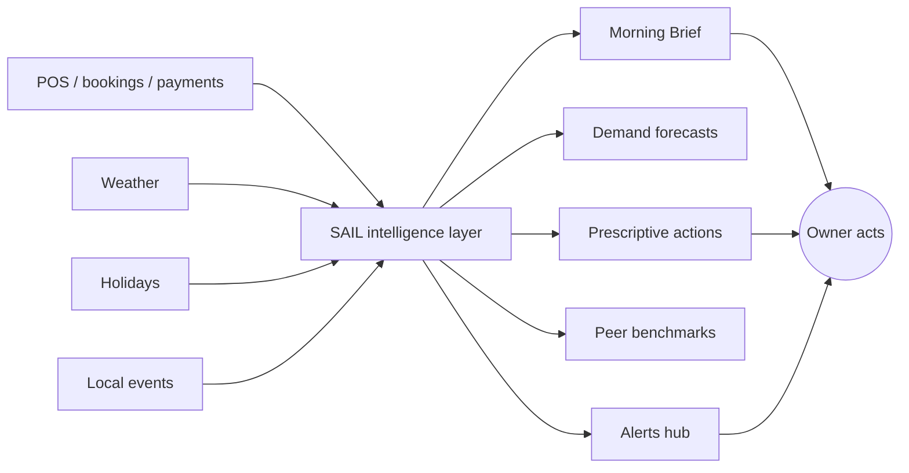

# SAIL — Product Vision and Scope

**Project:** SAIL · **Doc:** 01 · **Date:** 2026-07-18 · **Status:** Draft v1.0

---

## 1. Vision statement

**SAIL gives every independent operator the analytical team a chain has, for the price of a part-time shift.**

SAIL is a multi-tenant SaaS that connects to an SMB's own transaction data (POS, bookings, payments) and enriches it with external signals — weather, holidays, and local events — to produce KPI dashboards, demand forecasts, and, most importantly, **prescriptive recommendations the owner can act on before the day starts.**

The product does not sell dashboards. It sells **answers**: *make 20% less banana bread tomorrow, it's raining; call in one extra barista for Saturday's farmers market; push a 3–5pm iced-coffee promo Thursday because the heatwave hits and you're 30% below your usual afternoon covers.*

### The problem, in the owner's words

> "I know Saturdays are busy and Tuesdays are dead. What I don't know is *how* busy this Saturday will be — and by the time I find out, I've either thrown out forty croissants or turned people away because I ran out."

> "Square shows me charts. Great. I don't have time to read charts at 5am. Just tell me what to do differently today."

> "My accountant tells me what happened last month. I need to know what's going to happen next week, while I can still change my order."

> "I'm competing with a chain two doors down that has a data team. I have me, a spreadsheet, and a gut feeling."

These are the four failures SAIL is built to fix: **no forward view, no time to interpret, no timely action, no analytical leverage.** The gap is not a shortage of data — POS systems generate plenty. The gap is the last mile between raw data and a confident decision, made at the moment it still matters.

---

## 2. A day in the life — before vs. after SAIL

### Café owner-operator — "Maria's Corner", one location

| | **Before SAIL** | **After SAIL** |
|---|---|---|
| **5:15am** | Maria eyeballs yesterday's till, guesses today's prep from memory and the weather she sees out the window. | Maria opens the **Morning Brief** on her phone: *"Expect ~+18% vs. a normal Wednesday — sunny + local college move-in day. Prep +2 trays of pastries, front-load cold brew. Yesterday you 86'd oat milk by 2pm — order today."* |
| **11:00am** | A tour bus arrives; she runs out of sandwiches, loses ~$300 in walk-outs. | The event signal already flagged elevated foot traffic; she prepped extra. Sandwiches hold until 1pm. |
| **2:30pm** | Slow afternoon, three staff standing around; she doesn't notice the labor overspend until payroll. | An **alert** fired at open: *"Thu 2–5pm forecast is soft — consider cutting one shift or running a happy-hour promo."* She cut one barista and saved ~$70. |
| **8:00pm** | Throws out 30+ unsold pastries. Doesn't track it. | Waste is logged against forecast; **peer benchmark** shows her waste rate is 2x similar cafés, with a prescriptive fix: bake-to-order after 3pm. |
| **Sunday night** | Dreads doing the schedule; builds it from gut. | SAIL's **staffing forecast** proposes next week's cover-by-hour; she approves it in five minutes. |

Net effect for Maria: less waste, fewer stockouts, right-sized shifts, and a forward view she never had — delivered as **one 30-second read** each morning, not a dashboard she has to mine.

### Motel / small-hotel GM — "Riverside Motor Inn", 42 rooms

| | **Before SAIL** | **After SAIL** |
|---|---|---|
| **Monday planning** | GM sets rates by copying last month and glancing at one competitor. | **Morning Brief**: *"Fri–Sat forecast 92% occupancy — regional soccer tournament 4 miles away. You're priced $20 below the pace of similar motels; raise weekend ADR."* |
| **Housekeeping** | Fixed staffing regardless of arrivals; either idle or overwhelmed. | Occupancy forecast drives a **housekeeping/labor plan** by day; the GM scales to the actual arrival curve. |
| **Midweek dip** | Tuesday/Wednesday run 40% empty, no lever pulled. | Prescriptive nudge: *"Midweek soft next week — push a 2-night 'work-from-here' rate on your booking page and Google."* |
| **Month-end** | Reconciles what happened; too late to influence it. | KPIs (RevPAR, ADR, occupancy, ancillary) tracked live vs. forecast and vs. peer set; variances surfaced while still actionable. |

Net effect for the GM: better rate timing against demand, right-sized housekeeping, and midweek revenue recovery — without buying an enterprise revenue-management system.

---

## 3. Enhanced product concept

Our initial idea — *"turn a small business's data into insights"* — is sound but under-specified. SAIL sharpens it into a concrete, differentiated product built around one organizing principle: **deliver a decision, not a report.** The capabilities below define what that means.

### 3.1 The automated Morning Brief
The flagship surface. A once-a-day, plain-language digest delivered to the owner's phone (push/SMS/email) before opening. It contains: today's demand call vs. a normal day, the top 1–3 prescriptive actions, one thing that went unusually well or badly yesterday, and any live alerts. Designed to be read in **under 60 seconds**. This is the primary reason a non-data-literate owner keeps the product.

### 3.2 Demand forecasting for prep, stock, and staffing
Per-location, per-daypart forecasts of covers/transactions and, where item-level POS data allows, top-item demand. Outputs translate directly into operational plans: **prep quantities, reorder suggestions, and cover-by-hour staffing** — the three decisions that actually move margin in hospitality.

### 3.3 Weather / holiday / event triggers
External signals are first-class inputs, not decoration. SAIL blends local weather forecasts, public/retail holidays, and nearby events (festivals, games, conventions, school calendars) into the demand model, and — crucially — **explains the driver in the recommendation** ("+18% because sunny + move-in day"), which is what earns the owner's trust.

### 3.4 Prescriptive promo suggestions
When the forecast shows a soft daypart, SAIL proposes concrete, revenue-recovering actions — a timed discount, a bundle, a channel to push it on — sized to the gap. The owner accepts, edits, or dismisses; accepted actions are tracked for lift.

### 3.5 Waste and labor optimization
- **Waste:** compares prep/stock to realized demand, flags systematic over-production, and quantifies the dollars.
- **Labor:** compares scheduled hours to forecast demand, flags over/under-staffed dayparts, and proposes shift adjustments. Labor and COGS are the two largest controllable costs in these segments; SAIL targets both directly.

### 3.6 Peer benchmarking — "you vs. similar businesses"
Anonymized, aggregated cross-tenant comparison against a **like-for-like cohort** (segment, size, region). "Your afternoon attach rate is 12% vs. a peer median of 19%" turns an abstract metric into a competitive, motivating signal. This benefit **compounds** as the tenant base grows and is a structural moat (see [Market and Feasibility](02_Market_and_Feasibility.md)).

### 3.7 Per-tenant ICP personalization
On onboarding, each tenant is profiled (segment, size, menu/room mix, goals, data quality) into an **ideal-customer-profile record** that tunes which KPIs surface, which recommendations are relevant, and the tone/format of the Brief. A coffee shop and a motel get materially different products from the same platform.

### 3.8 Multi-location roll-up
For the multi-unit operator: a portfolio view with location league tables, roll-up KPIs, and drill-down to any single site — while each location keeps its own forecasts and briefs.

### 3.9 Alerts hub
A single place for exception-driven notifications (stockout risk, labor overspend, anomaly in sales, forecast breach, data-connection failure), with per-user channel and threshold preferences. Prevents the "too many notifications" failure that kills engagement.

### 3.10 Integrations marketplace
A growing, self-serve catalog of one-click connectors — POS, booking/PMS, payments, accounting, review platforms. Connector breadth is the primary determinant of both time-to-value and addressable market; the marketplace makes it visible and extensible (see [Appendix B](appendix/B_Data_Sources_and_Integrations.md)).

---

## 4. Product principles

1. **Answers, not dashboards.** The default surface is a prioritized recommendation. Charts exist to justify the answer, never to replace it. If a feature can't be reduced to "so what should I do?", it ships behind an "advanced" fold.
2. **Fast time-to-value.** From connect to first useful insight in **minutes, not weeks**. Onboarding is a guided connector flow; the first Morning Brief lands the next business day. No data modeling asked of the owner.
3. **Explainable, trustworthy AI.** Every forecast and recommendation states its driver and its confidence in plain language. SAIL is honest about uncertainty and about thin data. Trust is the product's true retention lever — one confidently-wrong recommendation costs more than ten vague ones.
4. **Mobile-first for owners.** The owner lives on their phone, on the floor, not at a desk. The Brief, alerts, and action approvals are built phone-first; the richer web app serves the ops-manager persona.

---

## 5. Personas

### Persona A — Café owner-operator ("Maria")
- **Context:** Single café, 3–8 staff, Square/Toast POS, runs the floor herself. Not data-literate; time-poor.
- **Goals:** Cut waste, avoid stockouts, staff correctly, feel in control of a chaotic week.
- **Pains:** Guesswork prep, payroll surprises, no forward view, no time to analyze anything.
- **How SAIL helps:** Morning Brief + prep/stock/staffing forecasts + waste benchmark. The Brief is the entire product for her; everything else is optional depth.

### Persona B — Motel / small-hotel GM ("David")
- **Context:** 20–80 rooms, independent or light-flag, PMS + a booking channel or two. Some numeracy, no revenue-management tooling.
- **Goals:** Lift RevPAR, time rates to demand, right-size housekeeping, recover midweek occupancy.
- **Pains:** Rates set by habit, enterprise RMS priced out of reach, labor mis-matched to arrivals.
- **How SAIL helps:** Occupancy/ADR forecasts, event-driven rate nudges, housekeeping labor plan, peer benchmarking against similar properties.

### Persona C — Small multi-location restaurant ops manager ("Priya")
- **Context:** 2–6 restaurant locations, oversees managers, reports to an owner. Comfortable with numbers, wants leverage not spreadsheets.
- **Goals:** Standardize performance across sites, spot the underperformer fast, plan labor and purchasing across the group.
- **Pains:** Reconciling data across locations by hand, no like-for-like comparison, reactive not proactive.
- **How SAIL helps:** Multi-location roll-up, location league tables, group-level forecasts, per-site briefs she can forward to each manager.

---

## 6. Value proposition per segment

| Segment | Core promise | The money lever | Emotional win |
|---|---|---|---|
| **Cafés / coffee shops** | "Know your day before it starts." | Reduced food waste + right-sized shifts | Less 5am guesswork, less end-of-day trash guilt |
| **Restaurants (QSR / casual)** | "Prep, staff, and promote to actual demand." | COGS + labor as % of sales | Control over the two costs that decide the month |
| **Ice-cream / seasonal** | "Turn the weather into a plan." | Waste on perishable, weather-timed staffing | Confidence through wild demand swings |
| **Motels / small hotels** | "Enterprise revenue timing, SMB price." | RevPAR via rate timing + housekeeping labor | Compete with the flagged property down the road |
| **Small retail / service** | "See demand coming; stock and staff for it." | Inventory carrying cost + labor | Fewer stockouts, fewer dead shifts |

---

## 7. Scope

### 7.1 In scope for v1 (Phases 0–2)
- Secure multi-tenant data ingestion from the **priority POS/booking connectors** (see [Appendix B](appendix/B_Data_Sources_and_Integrations.md)).
- Automated transformation pipeline and a curated **KPI catalog** per segment (see [Appendix A](appendix/A_KPI_and_Metrics_Catalog.md)).
- External signal enrichment: weather, holidays, local events.
- Demand forecasting (covers/transactions, daypart-level) with prep/stock/staffing outputs.
- The **Morning Brief** (push/SMS/email) with GenAI-authored plain-language narrative.
- Prescriptive recommendations: promo suggestions, waste and labor flags.
- **Alerts hub** with per-user channels and thresholds.
- Peer benchmarking (launches once tenant cohorts reach a minimum anonymization threshold).
- Per-tenant ICP personalization.
- Multi-location roll-up (basic).
- Subscription billing across the tier structure (see [Subscription Tiers](04_Subscription_Tiers_and_Feature_Matrix.md)).
- Mobile-first owner experience + web app.

### 7.2 Out of scope / future
- Deep item-level menu-engineering and recipe-level COGS modeling.
- Full inventory management / automated purchase-order placement.
- Full workforce management (time & attendance, payroll, compliance scheduling) — SAIL *recommends*, WFM *executes*; integration over ownership.
- Native, fully-featured revenue-management for hotels (channel manager, rate shopping) — start with rate *nudges*, not full RMS.
- Marketing execution / campaign management beyond promo suggestion.
- A public connector SDK for third-party developers.
- Non-US markets and multi-currency/localization.

### 7.3 Explicit non-goals
- **SAIL is not a BI tool.** We will not compete on chart-building flexibility or self-serve query. Configurability is deliberately constrained in favor of guided answers.
- **SAIL is not a POS or a system of record.** It reads from systems of record; it never becomes one.
- **SAIL is not an accounting or bookkeeping product.**
- **SAIL will not surface a recommendation it cannot explain or justify from data.** No black-box "trust us" outputs.

---

## 8. Product success metrics

| Metric | Definition | v1 target | Why it matters |
|---|---|---|---|
| **Activation rate** | % of new tenants who connect a data source and receive their first Morning Brief | ≥ 80% within 7 days | The single strongest predictor of retention |
| **Time-to-first-insight** | Median time from signup to first usable Brief | < 24 hours (same/next business day) | Delivers on the fast-time-to-value principle |
| **Morning Brief engagement** | % of active tenants opening the Brief ≥ 4 days/week | ≥ 60% | The Brief *is* the habit; engagement = stickiness |
| **Forecast adoption** | % of tenants who act on ≥ 1 recommendation/week (accept promo, adjust prep/staff) | ≥ 40% | Proves prescriptive value, not just usage |
| **Recommendation acceptance rate** | Accepted ÷ surfaced recommendations | ≥ 30% | Direct proxy for recommendation quality/trust |
| **Realized value** | Self-reported or measured waste/labor $ saved per tenant/month | ≥ 3–5x subscription price | Underwrites the ROI story and pricing (see [Market and Feasibility](02_Market_and_Feasibility.md)) |
| **Net revenue retention** | Expansion + retention of subscription revenue | ≥ 100% by month 12 | Validates the tier ladder and multi-location expansion |
| **Logo retention** | % of tenants retained month-over-month | ≥ 95% monthly | SMB churn is the core commercial risk (see [Risks](13_Risks_Assumptions_Dependencies.md)) |

All quantitative assumptions and constants underpinning these targets are consolidated in [Appendix C](appendix/C_Assumptions_and_Constants.md).

---

## Related documents
- [00 — Executive Summary](00_Executive_Summary.md)
- [02 — Market and Feasibility](02_Market_and_Feasibility.md)
- [03 — Functional Requirements](03_Functional_Requirements.md)
- [04 — Subscription Tiers and Feature Matrix](04_Subscription_Tiers_and_Feature_Matrix.md)
- [07 — AI/ML Strategy](07_AI_ML_Strategy.md)
- [13 — Risks, Assumptions, Dependencies](13_Risks_Assumptions_Dependencies.md)
- [Appendix A — KPI and Metrics Catalog](appendix/A_KPI_and_Metrics_Catalog.md)
- [Appendix B — Data Sources and Integrations](appendix/B_Data_Sources_and_Integrations.md)
- [Appendix C — Assumptions and Constants](appendix/C_Assumptions_and_Constants.md)
- [Appendix D — Glossary](appendix/D_Glossary.md)
