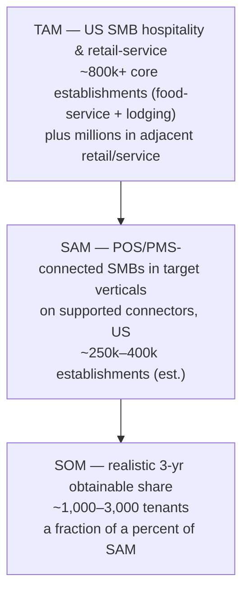

# SAIL — Market and Feasibility

**Project:** SAIL · **Doc:** 02 · **Date:** 2026-07-18 · **Status:** Draft v1.0

---

This document sizes the opportunity, maps the competitive field, assesses buildability, stress-tests the pricing, and gives a go / no-go recommendation. All figures marked *(est.)* are directional estimates from public-knowledge reference points, not audited market data; they are intended to frame magnitude and prioritization, not to be quoted as precise. Underlying assumptions are consolidated in [Appendix C](appendix/C_Assumptions_and_Constants.md).

---

## 1. Market sizing (directional)

We use a standard TAM / SAM / SOM funnel scoped to **US SMB hospitality and retail-service** — the end customers SAIL serves.

### Reference universe (US, est.)

| Segment | Establishments (est.) | Basis |
|---|---|---|
| Restaurants / eating & drinking places | ~700,000+ | Long-cited US restaurant industry establishment counts |
| Coffee shops / cafés | ~40,000–70,000 | Coffee & snack shop category estimates |
| Hotels / motels / lodging | ~60,000+ properties | US lodging property counts |
| Ice-cream / frozen dessert shops | ~20,000+ | Specialty food-service category |
| Small retail & personal-service (SMB, POS-driven) | Several million | Broad; only a fraction are a near-term fit |

> These are order-of-magnitude figures. The point is not precision but that the beachhead alone (independent food-service + small lodging) is in the **hundreds of thousands of establishments** in the US.

### TAM / SAM / SOM

| Layer | Definition | Directional size | Directional annual value |
|---|---|---|---|
| **TAM** | All US SMB hospitality + retail-service establishments that could use demand intelligence | ~800k+ core; millions adjacent | Multi-billion $ if fully penetrated |
| **SAM** | Those on **supported POS/PMS connectors**, in target verticals, data-mature enough to serve today | ~250k–400k establishments *(est.)* | At a blended ~$400/mo ACV, an addressable pool in the low-single-digit **$ billions** |
| **SOM (3-yr)** | What SAIL can realistically win via the café/QSR beachhead then lodging | ~1,000–3,000 tenants | At ~$400/mo blended, roughly **$5M–14M ARR** |

**Read:** the market is large and fragmented; SAIL does not need meaningful share to build a healthy business. Winning ~2,000 tenants — a rounding error against SAM — supports an ~$8–10M ARR business at the constants in [Appendix C](appendix/C_Assumptions_and_Constants.md). The strategic risk is not TAM; it is **acquisition cost and retention in a notoriously churny, price-sensitive segment** (see §5, §6, and [Risks](13_Risks_Assumptions_Dependencies.md)).

---

## 2. Tailwinds

- **POS/PMS API maturity.** Square, Toast, Clover, and modern PMS platforms now expose robust, well-documented APIs and OAuth. Five years ago, ingesting SMB transaction data cleanly was the hard part; today it is largely a connector-engineering problem, not a data-access problem.
- **AI adoption and expectations.** SMB owners now expect "AI that tells me what to do." The GenAI narrative layer (plain-language Brief) is exactly the interface this audience has been primed to accept, and it dramatically lowers the interpretation barrier that killed prior BI-for-SMB attempts.
- **Labor and margin pressure.** Persistent wage inflation and thin food-service margins make labor and waste optimization a board-level survival issue for operators — SAIL targets the two largest controllable costs directly.
- **SMB software spend is growing.** Operators already pay for POS, scheduling, delivery, and reputation tools. A prescriptive analytics layer slots into an existing, expanding software budget rather than creating a new one from zero.
- **Falling inference cost.** Small, cheap models (Claude Haiku / GPT-4o-mini class) make per-tenant GenAI economically trivial, protecting the ~90%+ infra gross margin (see [Hosting and Infrastructure Costs](10_Hosting_and_Infrastructure_Costs.md)).

---

## 3. Competitive landscape

The field is real and crowded — but it is split into camps that each miss a different part of SAIL's target: **prescriptive, cheap, and SMB-simple, all at once.**

| Category | Representative products | Typical price | SMB fit (café/motel) | Prescriptive? | Setup effort |
|---|---|---|---|---|---|
| **POS-native analytics** | Square Dashboard, Toast Analytics, Clover reporting | Bundled with POS | High (already there) | No — descriptive dashboards | Low |
| **Restaurant analytics / forecasting** | Restaurant365, MarginEdge, Lineup.ai, 5-Out | $$–$$$; often mid-market+ | Medium — skew to multi-unit / back-office | Partial (forecasting; some prescriptive) | Medium–High |
| **General BI** | Metabase, Tableau, Power BI, Looker Studio | Free–$$$ | Low — needs a data person | No — you build it yourself | High |
| **Hotel revenue management (RMS)** | IDeaS, Duetto | $$$$ enterprise | Very low for small motels | Yes, for pricing | High |
| **SAIL** | — | $79–800/mo (see [Tiers](04_Subscription_Tiers_and_Feature_Matrix.md)) | **High — built for it** | **Yes — the core** | **Low — guided connectors** |

Reading the table:
- **POS-native tools** own the data and are free, but stop at descriptive charts — they show *what happened*, not *what to do*. This is SAIL's opening and its distribution risk simultaneously (a POS could add prescriptions).
- **Restaurant analytics platforms** are the closest competitors and some are genuinely good at forecasting, but they generally target multi-unit operators and back-office finance, carry heavier setup/onboarding, and price above a solo café's tolerance. They also rarely span **both food-service and lodging**.
- **General BI** requires a skill and a person the SMB owner does not have. It is a non-starter for the persona, which is precisely why "answers not dashboards" is the wedge.
- **Hotel RMS** proves demand for prescriptive pricing — but is enterprise-priced and enterprise-complex, leaving independent motels entirely unserved. SAIL's lodging play is "RMS-lite at an SMB price," not RMS.

---

## 4. Differentiation and moat

1. **Prescriptive, not descriptive.** The category is saturated with dashboards. SAIL's default output is a decision ("do this today, because"), authored in plain language. This is a *product-philosophy* moat — it requires building the whole stack (data → ML → GenAI narrative) around action, which dashboard vendors are structurally reluctant to do.
2. **Compounding cross-tenant benchmark data.** Every tenant improves the peer benchmarks and, over time, the forecasting priors for its cohort. This is a genuine **data network effect**: the product gets more valuable and more accurate as the base grows, and a new entrant starts from zero. It is defensible in a way features are not.
3. **Time-to-value.** Connect-to-first-Brief in under a day, versus weeks of onboarding for mid-market tools. For a time-poor owner, fast, effortless value is itself a moat against heavier competitors.
4. **Cross-segment breadth on one platform.** Serving café, QSR, and small lodging from a shared intelligence layer with per-tenant ICP personalization spreads platform cost across segments none of the point solutions cover together.

The realistic caveat: none of these is an *absolute* barrier. The durable defensibility is **(2) compounding data + (3) time-to-value + brand/trust**, accumulated by moving first and retaining well. See [Risks](13_Risks_Assumptions_Dependencies.md) for the "POS vendor adds prescriptions" threat.

---

## 5. Feasibility assessment

| Dimension | Rating | Reasoning |
|---|---|---|
| **Technical** | **High** | The stack is proven and off-the-shelf (Next.js/Vercel, FastAPI, Supabase+RLS, Prefect/dbt, Prophet/LightGBM/Nixtla, Haiku/4o-mini). Nothing requires novel research. Multi-tenancy via Postgres RLS is a well-trodden pattern. Forecasting SMB demand from daily/hourly transaction series is a solved problem class. See [System Architecture](05_System_Architecture.md) and [AI/ML Strategy](07_AI_ML_Strategy.md). |
| **Data** | **Medium** | The model is only as good as the connectors and the data quality behind them. Connector coverage, API rate limits, schema drift, and thin/short histories for new tenants are real constraints. Cold-start forecasting for a tenant with weeks of data needs cohort priors and honest confidence handling. Manageable, but connector-dependent — the primary engineering risk lives here. See [Data Strategy and ETL](06_Data_Strategy_and_ETL.md). |
| **Commercial** | **Medium (pricing risk)** | Demand for the *outcome* is strong; willingness to pay at the entry floor is the open question (see §6). A solo café at $200/mo is a stretch; the tier ladder and a Lite tier de-risk this materially. |
| **Operational** | **Medium** | The ongoing burden is **connector maintenance** — third-party APIs change, break, and rate-limit, and each break silently degrades a tenant's product. This needs monitoring, alerting, and a support motion from day one, not as an afterthought. Per-tenant support load for a non-technical audience is the other operational cost to manage. |

Overall feasibility: **strong build, moderate market execution risk.** The hard parts are commercial and operational (pricing, connectors, churn), not technical.

---

## 6. Pricing reality check

Our tiers — **Starter $200 · Growth $500 (most popular) · Scale $800** per month — are well-judged for **multi-location and lodging** operators, where the ROI math is easy. They are a **high floor for a single independent café**, and honesty here protects the whole business case.

### The floor problem
A solo café doing, say, $30–60k/month in revenue budgets software in the tens of dollars, not hundreds. $200/mo is ~$2,400/yr — a real line item for an owner who already pays for POS, scheduling, and delivery. Many will love the product and still balk at the price. Losing that owner at the door forfeits both revenue *and* the cross-tenant data that powers the moat.

### Competitor price benchmark
- POS-native analytics: effectively **$0** (bundled) — the free anchor SAIL must clear on value.
- Restaurant analytics/forecasting tools: broadly **mid-hundreds to low-thousands per month**, aimed above the solo operator.
- Hotel RMS: **enterprise pricing**, out of reach for small motels.

SAIL is well inside the gap — cheaper and simpler than the analytics platforms, far cheaper than RMS, and justified over free POS dashboards by being prescriptive. But the *entry* price must meet the smallest operator where they are.

### Recommendations
1. **Introduce the Lite tier at $79–99/mo.** A deliberately scoped entry point (single location, core Morning Brief, basic forecast, headline benchmarks) that lands the solo café, seeds the benchmark data, and creates a natural upgrade path to Growth. This is the single most important pricing move.
2. **Lead with annual billing (~2 months free).** Improves cash flow, and — critically — **blunts monthly churn**, the core commercial risk in this segment.
3. **Sell on ROI, not on features.** Frame every plan against payback: reduced waste + labor optimization + incremental sales from timed promos. If SAIL saves a café even a few hundred dollars a month in waste and mis-timed shifts, Growth pays for itself several times over. The [product success metric](01_Product_Vision_and_Scope.md) "realized value ≥ 3–5x subscription price" is the sales argument made concrete.

Illustrative ROI framing (directional):

| Tenant | Plan | Plausible monthly value | Payback |
|---|---|---|---|
| Solo café | Lite $79–99 | $300–800 saved (waste + labor) | 3–8x |
| Busy café / QSR | Growth $500 | $1,500–3,000 (waste, labor, promo lift) | 3–6x |
| Small hotel / multi-unit | Scale $800 | $3,000–8,000+ (RevPAR + housekeeping labor) | 4–10x |

---

## 7. Go / no-go recommendation

**Recommendation: GO — proceed to build, with two conditions.**

1. **Add the Lite tier and beachhead on café / QSR first.** Independent cafés and quick-service restaurants offer the cleanest POS data, the highest establishment counts, the fastest path to a repeatable onboarding, and the fastest accumulation of cross-tenant benchmark density. Prove the Morning Brief + forecast + waste/labor loop here.
2. **Expand to lodging second.** Small motels/independent hotels are underserved (RMS is priced out) and carry higher ACV, but the connector and data work (PMS, occupancy, ADR) is a distinct effort. Sequence it after the food-service loop is proven, reusing the same intelligence layer.

**Why go:** the technical build is low-risk and the stack is proven; the market is large, fragmented, and structurally underserved between free-but-dumb POS dashboards and expensive-but-complex enterprise tools; the prescriptive + compounding-benchmark combination is a defensible wedge; and the economics (~90%+ infra gross margin, low per-tenant COGS) are excellent once retention holds.

**What must be true (watch-items, tracked in [Risks](13_Risks_Assumptions_Dependencies.md)):** the Lite tier converts and upgrades; monthly churn stays low (annual billing + realized-value proof); connector maintenance is resourced as a first-class function; and cold-start forecast quality is good enough to earn trust in a tenant's first weeks. If those hold, SAIL is a strong build.

---

## Related documents
- [00 — Summary](00_Executive_Summary.md)
- [01 — Product Vision and Scope](01_Product_Vision_and_Scope.md)
- [04 — Subscription Tiers and Feature Matrix](04_Subscription_Tiers_and_Feature_Matrix.md)
- [05 — System Architecture](05_System_Architecture.md)
- [06 — Data Strategy and ETL](06_Data_Strategy_and_ETL.md)
- [07 — AI/ML Strategy](07_AI_ML_Strategy.md)
- [10 — Hosting and Infrastructure Costs](10_Hosting_and_Infrastructure_Costs.md)
- [11 — Build Cost and Commercials](11_Build_Cost_and_Commercials.md)
- [13 — Risks, Assumptions, Dependencies](13_Risks_Assumptions_Dependencies.md)
- [Appendix B — Data Sources and Integrations](appendix/B_Data_Sources_and_Integrations.md)
- [Appendix C — Assumptions and Constants](appendix/C_Assumptions_and_Constants.md)
- [Appendix D — Glossary](appendix/D_Glossary.md)
