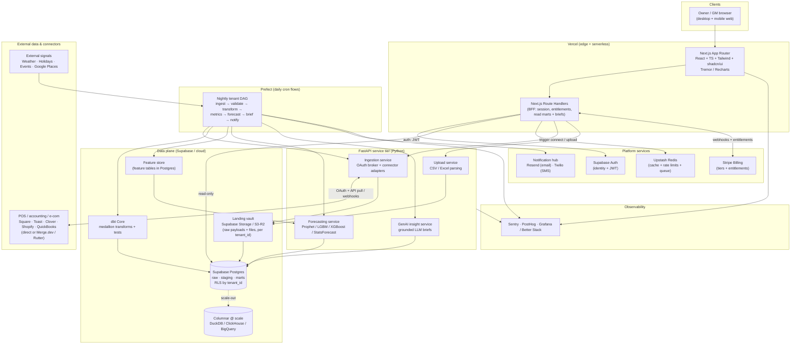
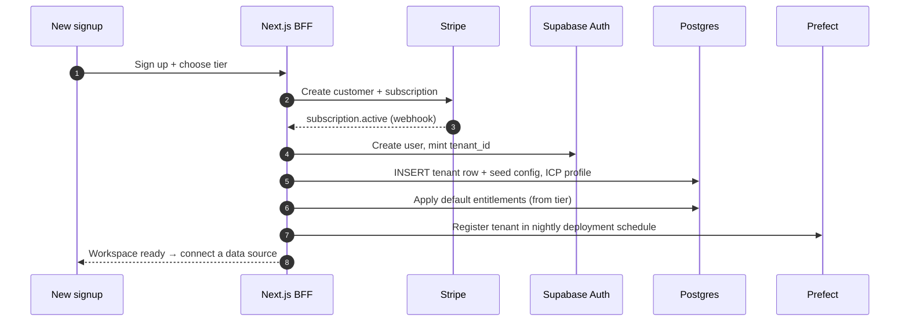
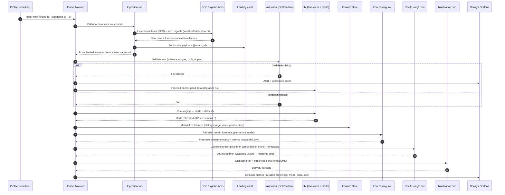
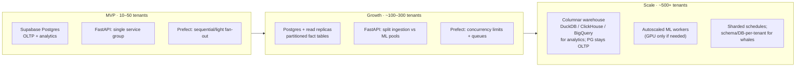

# 05 — System Architecture

**Project:** SAIL · **Doc:** 05 · **Date:** 2026-07-18 · **Status:** Draft v1.0

---

## 1. Architecture overview

SAIL is a **multi-tenant analytics SaaS** built as a small set of cooperating services rather than a monolith: a **Next.js web app + BFF** for everything a tenant sees and does interactively, a **FastAPI service tier** for data/ML work that is Python-native, and a **Prefect-orchestrated nightly pipeline** that does the heavy lifting off the request path. State lives in **Supabase Postgres** (OLTP + analytics at MVP) behind **Row-Level Security**, with a **landing vault** in object storage for raw payloads and files. Everything is keyed by `tenant_id`.

The design goal is a **thin, always-fast read path** (dashboards read pre-computed marts and cached briefs — never trigger a model at page load) and a **fat, scheduled write path** (the nightly cron ingests, validates, transforms, forecasts, and writes results back). This separation is what keeps per-tenant cost low and dashboards sub-second while forecasts and LLM briefs — the expensive parts — run once per tenant per day.

### The 4-stage reference pipeline → system components

Our four-stage reference diagram is adopted verbatim as the backbone and mapped onto concrete components:

| Stage (client diagram) | What it does | SAIL components that implement it |
|---|---|---|
| **1 · Secure Data Ingestion** | One-click OAuth connectors + flat-file upload; per-tenant "landing vault" keyed by `tenant_id` | Next.js connector UI → FastAPI **Ingestion service** (OAuth broker, connector adapters / Merge.dev) + **Upload service** (CSV/Excel) → **Landing vault** (Supabase Storage / S3-R2) → raw rows in Postgres `raw` schema |
| **2 · Automated Transformation** | Nightly scheduled cleaning, validation, relational staging | **Prefect** nightly flow → **Great Expectations / Pandera** validation gate → **dbt Core** medallion (`raw → staging → marts`) → **dbt tests** |
| **3 · Predictive ML** | Pre-computed metric layer + Prophet/XGBoost forecasting + GenAI translation to plain English | **Metric marts** (dbt) + **Feature store** → **Forecasting service** (Prophet baseline, LightGBM/XGBoost with external regressors, StatsForecast for cold-start) → **GenAI insight service** (Claude Haiku / GPT-4o-mini, grounded output) |
| **4 · Prescriptive Output** | React workspace shell, embedded visualization, digital notification hub | **Next.js workspace** (shadcn/ui + Tremor/Recharts) + **BFF** reading marts/briefs → **Notification hub** (Resend email, Twilio SMS) |

Cross-cutting: **Supabase Auth** (identity + RLS), **Stripe Billing** (subscription + entitlements), and **observability** (Sentry, PostHog, Grafana/Better Stack) wrap all four stages. ETL and model internals are specified in [Data Strategy & ETL](06_Data_Strategy_and_ETL.md) and [AI/ML Strategy](07_AI_ML_Strategy.md); this document covers how the pieces fit and run.

---

## 2. High-level system diagram



---

## 3. Multi-tenant model

### 3.1 Default: shared schema + Row-Level Security

Every tenant-owned table carries a non-null `tenant_id uuid` column. Isolation is enforced in the database, not the application, via **Postgres RLS**: policies compare `tenant_id` against the tenant claim in the Supabase JWT (`auth.jwt() ->> 'tenant_id'`, surfaced through a `current_tenant_id()` helper). Because the BFF reads Postgres with the caller's JWT, a bug in application code cannot leak another tenant's rows — the database refuses them.

```sql
-- Every tenant table follows this pattern
alter table marts.daily_kpis enable row level security;

create policy tenant_isolation on marts.daily_kpis
  using (tenant_id = current_tenant_id());

-- Pipeline/service writes use a service role that sets the tenant
-- explicitly per unit of work, never a blanket bypass in request code.
```

| Concern | Mechanism |
|---|---|
| Read isolation | RLS policy on every tenant table; BFF uses the user JWT (anon/authenticated role) |
| Write isolation (pipeline) | FastAPI/Prefect use the service role but scope each flow run to one `tenant_id`; `set_config('request.tenant_id', ...)` per run |
| Object storage | Landing vault paths are prefixed `s3://sail-landing/{tenant_id}/{source}/{yyyy}/{mm}/{dd}/`; bucket policies + signed URLs bind access to tenant |
| Secrets / connector tokens | Per-tenant OAuth tokens stored encrypted (Supabase Vault / KMS-wrapped), never in client-visible tables |
| Noisy-neighbor | Per-tenant concurrency limits + queue fairness in Prefect; Upstash rate limits on API tier |

Security-model detail (PII handling, encryption, PCI SAQ-A scope) lives in [Security & Compliance](09_Security_and_Compliance.md).

### 3.2 Tenant provisioning



Provisioning is **idempotent** and driven by the Stripe subscription lifecycle: a `tenant_id` is minted once, seeded with a default config + ICP profile, added to the RLS-scoped tables, and registered into the nightly Prefect schedule. Deprovision reverses this (revoke tokens, tombstone data per retention policy, remove from schedule).

### 3.3 When to consider schema- or DB-per-tenant

Shared-schema + RLS is the right default for hundreds of SMB tenants (low data volume each). Graduate a tenant to stronger isolation only on a concrete trigger:

| Isolation level | Use when | Trade-off |
|---|---|---|
| **Shared schema + RLS** (default) | All Starter/Growth tenants; ≤ low-millions rows/tenant | Cheapest, simplest ops; relies on correct policies |
| **Schema-per-tenant** | A **Scale** tenant needs custom marts, heavier query volume, or per-tenant migration cadence | More migration overhead; connection/catalog bloat past ~hundreds of schemas |
| **DB/instance-per-tenant** | Contractual data-residency/isolation requirement, or a whale tenant whose load threatens neighbors | Highest cost + ops; use sparingly, bill it into the Scale tier |

The application addresses tenants through a **routing layer** (tenant → connection/schema resolver) so the isolation strategy can change per tenant without touching feature code.

---

## 4. Component-by-component breakdown

| # | Component | Responsibility | Tech | Key notes |
|---|---|---|---|---|
| 1 | **Web app** | Tenant-facing workspace: dashboards, forecasts, prescriptive briefs, connector management, settings | Next.js (App Router) + TypeScript + Tailwind + shadcn/ui; charts via Tremor/Recharts; on **Vercel** | Server Components for data-heavy views; reads only pre-computed marts + cached briefs — never triggers a model synchronously |
| 2 | **BFF (app API)** | Session, entitlement checks, aggregation of reads, thin write actions, webhook receivers | Next.js Route Handlers | Owns the browser contract; delegates anything CPU/Python-heavy to FastAPI. Enforces tier entitlements before serving gated features |
| 3 | **API / ML services** | Ingestion, upload parsing, forecasting, GenAI insight generation | **FastAPI** (Python), Pydantic models, async | Separate deployables so ingestion I/O and ML CPU scale independently; invoked by both BFF (on-demand) and Prefect (scheduled) |
| 4 | **Connectors & ingestion** | OAuth broker, per-source adapters, incremental pulls, webhook intake, normalization to a canonical sales/line-item shape | FastAPI Ingestion service; direct Square/Toast/Clover/Shopify/QuickBooks **or** Merge.dev/Rutter aggregator | Build-vs-buy per source (see [Technology Stack §3](08_Technology_Stack.md)); watermark-based incremental sync; writes raw payloads to landing vault + `raw` schema. Detail in [Appendix B](appendix/B_Data_Sources_and_Integrations.md) |
| 5 | **Landing vault** | Immutable, per-tenant raw zone for every payload + uploaded file (replay/audit source of truth) | Supabase Storage / S3-R2, `{tenant_id}/…` prefixing | Nothing is transformed here; enables reprocessing without re-pulling from source APIs; lifecycle rules archive/expire old raw |
| 6 | **Orchestration** | Runs the nightly cron per tenant: ingest → validate → transform → metrics → forecast → brief → notify; retries, alerting, backfills | **Prefect** (deployments + daily cron schedule) | One parameterized flow, fanned out per `tenant_id`; concurrency limits for fairness; failed tasks retry with backoff and surface to Sentry/Slack. See [Data Strategy & ETL](06_Data_Strategy_and_ETL.md) |
| 7 | **Transformation** | Clean/validate/stage raw into analysis-ready marts; enforce data contracts | **dbt Core** medallion: `raw → staging → marts` + dbt tests | Runs inside the Prefect flow; versioned SQL models; marts are the only thing dashboards read |
| 8 | **Warehouse & marts** | Store canonical facts + pre-computed KPI/metric marts; serve reads | **Supabase Postgres** (MVP) → columnar (**DuckDB/ClickHouse/BigQuery**) at scale | Metric layer is pre-aggregated so reads are cheap; RLS on all tenant tables |
| 9 | **Feature store** | Curated, point-in-time feature tables joining tenant history with external regressors (weather/holiday/event) for training + inference | Feature tables in Postgres (MVP); materialized by dbt/Prefect | Guarantees train/serve parity; keeps regressor joins out of ad-hoc model code. Feature list in [AI/ML Strategy](07_AI_ML_Strategy.md) |
| 10 | **Forecasting service** | Per-tenant demand forecasts with external regressors; cold-start via pooled/global models | FastAPI; **Prophet** baseline, **LightGBM/XGBoost** with regressors, **Nixtla StatsForecast** for global/cold-start; MLflow for tracking | Nightly refresh + retrain cadence driven by Prefect; writes forecasts to marts; model choice per-tenant based on data volume |
| 11 | **GenAI insight service** | Translate computed metrics + forecasts into a plain-English prescriptive brief ("what to stock/staff/promote") | FastAPI; **Claude Haiku / GPT-4o-mini**, structured output | **Grounded**: prompts are filled only from computed metrics/forecasts — the model narrates numbers, it does not invent them. Output validated against a schema; cached per tenant/day |
| 12 | **Notification hub** | Deliver the daily brief + threshold alerts via email/SMS; manage preferences, opt-out, delivery status | **Resend** (email) + **Twilio** (SMS) | Triggered at the end of the nightly flow; templated; respects tier + per-user channel prefs and quiet hours |
| 13 | **Billing** | Tiers, subscriptions, entitlements, metering, dunning | **Stripe Billing** | Subscription webhooks drive provisioning + entitlement sync; no card data touches SAIL (PCI SAQ-A) |
| 14 | **Auth** | Identity, sessions, JWT with `tenant_id` claim, role mapping into RLS | **Supabase Auth** | JWT tenant claim is the linchpin of RLS; supports email + OAuth logins; roles: owner, manager, viewer |

Supporting: **Upstash Redis** (BFF cache, API rate limiting, lightweight queue) and **observability** (Sentry errors, PostHog product analytics, Grafana/Better Stack infra + pipeline SLAs).

---

## 5. Nightly cron run (sequence)

The nightly flow is the heart of SAIL. It runs once per tenant on a staggered schedule (US-timezone-aware, typically pre-dawn local) so a fresh dashboard + brief is waiting when the owner opens up.



Key properties: **watermark-based incremental pulls** (only new data), a **validation gate** that can degrade gracefully instead of publishing bad numbers, **idempotent tasks** (safe to retry), and **per-run cost/SLA metrics** emitted for every tenant so freshness and spend are observable. Retrain is not necessarily every night — cadence and triggers are defined in [AI/ML Strategy](07_AI_ML_Strategy.md).

---

## 6. Environments & CI/CD

| Environment | Purpose | Data | Notes |
|---|---|---|---|
| **dev** | Local + preview development | Synthetic / seeded fixtures | Vercel preview deploys per PR; local Supabase or a dev branch; Prefect runs against a dev workspace |
| **staging** | Pre-prod verification, migration dry-runs, full pipeline rehearsals | Anonymized sample or synthetic tenants | Mirrors prod config; nightly flow runs on a few canary tenants; used for load + model-regression checks |
| **prod** | Live tenants | Real tenant data (RLS-isolated) | Blue/green or gated promotions; feature flags for staged rollout |

**Pipeline (GitHub Actions):** lint + type-check (ESLint/tsc, Ruff/mypy) → unit + integration tests (Vitest/Playwright frontend; pytest backend) → **dbt build + dbt tests** on a warehouse clone → build → deploy. **Frontend** deploys to Vercel (preview per PR, promote to prod on merge). **FastAPI services** build to containers and deploy to the chosen runtime (Fly.io / Railway / Render / ECS). **Prefect** deployments are updated from CI so flow code and schedules are version-controlled. **DB migrations** run gated (Supabase migrations / Alembic) with a manual approval on prod. IaC (Terraform) captures infra so environments are reproducible — see [Technology Stack](08_Technology_Stack.md) and [Hosting & Infrastructure Costs](10_Hosting_and_Infrastructure_Costs.md).

---

## 7. Scalability path



| Dimension | MVP | Scale approach |
|---|---|---|
| **Storage/query** | Postgres for OLTP + analytics | Keep Postgres as OLTP/system-of-record; offload analytical marts to a **columnar** store (DuckDB embedded, or ClickHouse/BigQuery) when scan-heavy queries slow reads |
| **Compute (services)** | One FastAPI deployment group | Split **ingestion** (I/O-bound) from **forecasting** (CPU-bound) pools; autoscale each on its own signal |
| **Queue/workers** | Prefect light fan-out, Upstash Redis | Per-tenant concurrency limits + fair queues; scale worker pools horizontally; shard nightly schedule across windows to smooth load |
| **Read path** | Direct mart reads | Add read replicas + Redis caching of hot dashboards/briefs |
| **Tenant isolation** | Shared schema + RLS | Promote whales to schema-/DB-per-tenant (see §3.3) |

Cost envelopes for each stage are itemized in [Hosting & Infrastructure Costs](10_Hosting_and_Infrastructure_Costs.md) (MVP $300–700/mo → scale ~$2,500–5,000/mo).

---

## 8. Integration architecture

SAIL ingests from source systems with three complementary modes; the connector layer chooses per source based on what each API supports.

| Mode | When used | Mechanics |
|---|---|---|
| **Webhooks (push)** | Near-real-time events where the source supports them (e.g., Shopify orders, some Square events) | BFF/Ingestion receives signed webhooks → verify signature → enqueue (Upstash) → land raw. Keeps data fresh between nightly runs; deduped against watermark |
| **Polling (pull)** | The default for POS/accounting APIs without reliable webhooks | Nightly (and optional intraday) incremental pull since last **watermark** (updated-since cursor); page through results |
| **Backfill** | Onboarding a new tenant/connector, or after an outage/gap | Bounded historical pull (e.g., 12–24 months) in chunked, rate-limited batches; runs as a one-off Prefect flow separate from the nightly cadence so it never blocks steady-state runs |

**Rate-limit & retry handling** (uniform across modes):

- **Respect provider limits** — token-bucket/leaky-bucket client per source; honor `Retry-After` and `X-RateLimit-*` headers.
- **Retries with exponential backoff + jitter** on 429/5xx; cap attempts, then dead-letter the batch for inspection rather than failing the whole tenant run.
- **Idempotency** — every landed record carries source id + fetch cursor so replays/backfills don't double-count; upserts are keyed on natural source keys.
- **Watermarks** persisted per (tenant, source) so pulls are strictly incremental and resumable.
- **Aggregator fallback** — where per-source maintenance is costly, **Merge.dev/Rutter** normalizes many POS/accounting APIs behind one contract (build-vs-buy analysis in [Technology Stack §3](08_Technology_Stack.md)).

Connector-by-connector auth, scopes, rate limits, and data shapes are catalogued in [Appendix B](appendix/B_Data_Sources_and_Integrations.md); external-signal sources (weather/holidays/events/places) are covered there and in [Data Strategy & ETL](06_Data_Strategy_and_ETL.md).

---

## Related documents

- [06 — Data Strategy & ETL](06_Data_Strategy_and_ETL.md) — pipeline, dbt medallion, validation internals
- [07 — AI / ML Strategy](07_AI_ML_Strategy.md) — feature store, forecasting models, retrain cadence, GenAI grounding
- [08 — Technology Stack](08_Technology_Stack.md) — component tech choices, build-vs-buy, libraries
- [09 — Security & Compliance](09_Security_and_Compliance.md) — RLS, encryption, PII, PCI scope
- [10 — Hosting & Infrastructure Costs](10_Hosting_and_Infrastructure_Costs.md) — cost envelopes per scale stage
- [Appendix B — Data Sources & Integrations](appendix/B_Data_Sources_and_Integrations.md) — connector catalog + external signals
- [Appendix C — Assumptions & Constants](appendix/C_Assumptions_and_Constants.md) — canonical numbers, stack summary
