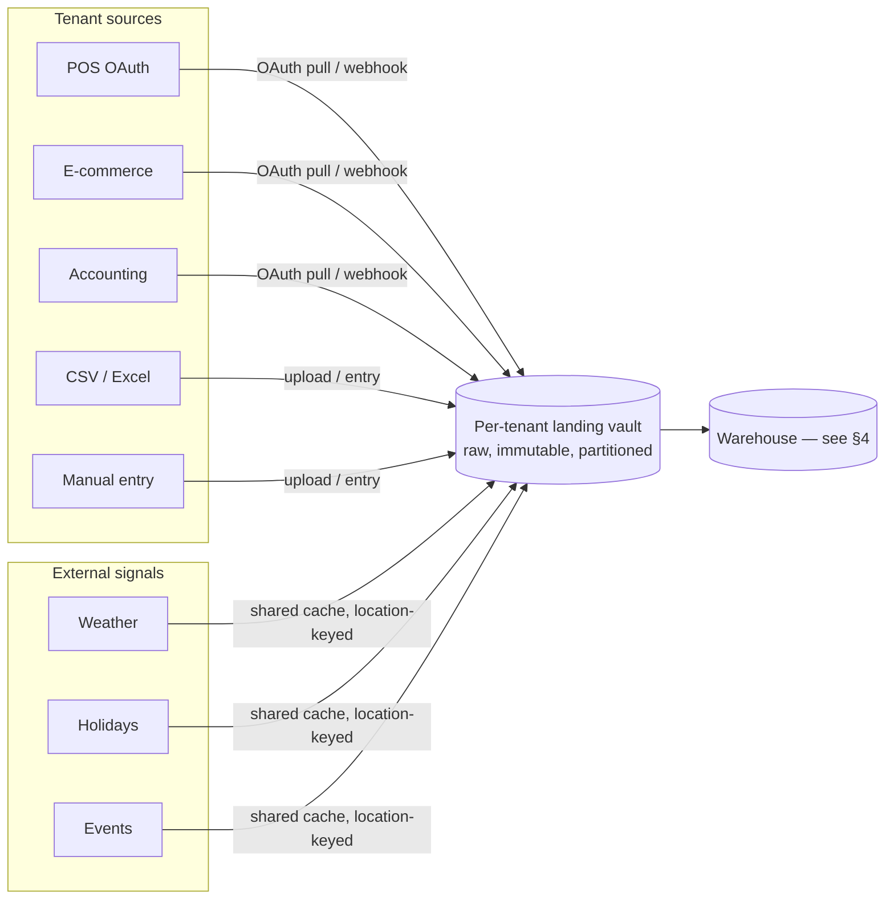
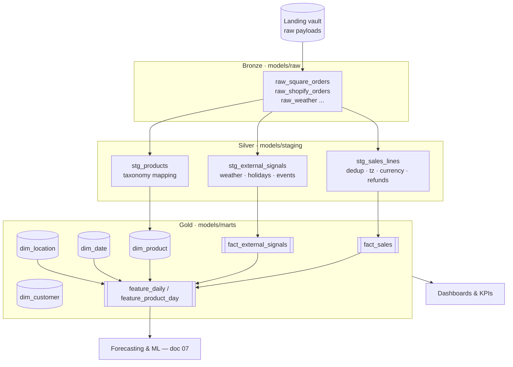
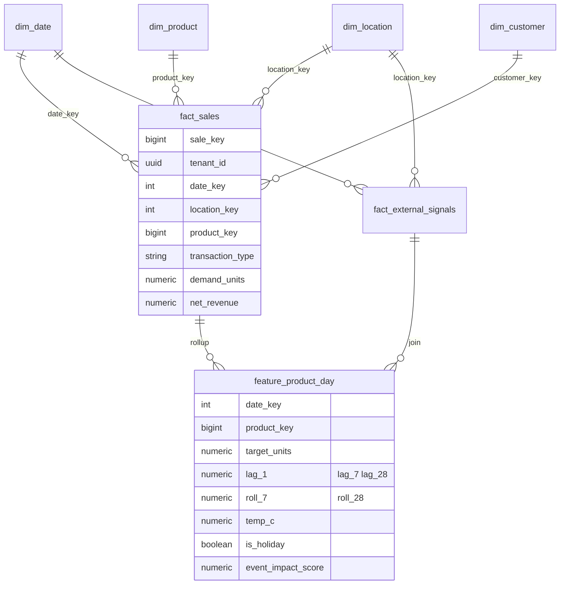

# 06 — Data Strategy & ETL

**Project:** SAIL · **Doc:** 06 · **Date:** 2026-07-18 · **Status:** Draft v1.0

---

SAIL lives or dies on data. The models in [AI / ML Strategy](07_AI_ML_Strategy.md) are only as good as the tables underneath them, and SMB source data is genuinely messy: a café that closes on Mondays, a POS migration mid-year, refunds booked three days late, the same latte sold under four different SKUs. This document describes how raw, inconsistent, multi-source SMB data becomes clean, validated, analysis-ready tables — reliably, every night, per tenant.

The design principle throughout: **land raw, transform in-warehouse, validate at every gate, and make every step idempotent and replayable.**

---

## 1. Data sources — catalog overview

SAIL blends two classes of data per tenant. **Internal** data is the tenant's own operational history (what actually sold). **External** data is the world around the business (why it sold, and what's coming). The forecasting value comes from joining the two.

| Class | Category | Representative sources | Grain | Update cadence |
|-------|----------|------------------------|-------|----------------|
| **Internal** | POS | Square, Toast, Clover, Lightspeed | Line-item / order | Near-real-time (webhook) or nightly poll |
| **Internal** | E-commerce | Shopify, WooCommerce | Order / line-item | Webhook + nightly reconcile |
| **Internal** | Accounting | QuickBooks, Xero | Invoice / journal / daily total | Nightly poll |
| **Internal** | Manual | CSV/Excel upload, in-app manual entry | Daily total or line-item | Ad-hoc / on upload |
| **External** | Weather | Visual Crossing, OpenWeather | Location × day (+ hourly) | Nightly (forecast horizon) |
| **External** | Holidays | Nager.Date, Calendarific | Country/region × day | Nightly (cached, near-static) |
| **External** | Events | Ticketmaster, SeatGeek, PredictHQ, Eventbrite | Location × event × datetime | Nightly |
| **External** | Places / foot-traffic | Google Places, Foursquare, Placer.ai | Location × day/hour | Nightly / weekly |
| **External** | Reviews | Google Business Profile, Yelp | Location × review | Nightly |
| **External** | Search trends | Google Trends | Term × region × week | Weekly |

The full field-level mapping, auth model, rate limits, and cost per source is maintained in **[Appendix B — Data Sources & Integrations](appendix/B_Data_Sources_and_Integrations.md)**. This document covers *how* the data moves and is shaped, not the per-source catalog.

**Design consequence of the two-class split:** internal data is tenant-private and never pooled raw; external data is location-keyed and heavily shared/cached across tenants (every café in the same ZIP gets the same weather row — we fetch once, fan out to many). This distinction drives both the cost model in [doc 10](10_Hosting_and_Infrastructure_Costs.md) and the privacy model in [Security & Compliance](09_Security_and_Compliance.md).

---

## 2. Ingestion patterns

SMB sources vary wildly in how they expose data. SAIL supports four ingestion patterns and picks the best available per connector, always landing an immutable raw copy first.

### 2.1 OAuth connectors (preferred for internal data)

The tenant authorizes SAIL against their POS/e-commerce/accounting account via OAuth 2.0. We store refresh tokens encrypted per tenant (see [Security & Compliance](09_Security_and_Compliance.md)) and pull on our schedule. Two implementation routes:

- **Direct connectors** — we own the OAuth app and API client for each platform (Square, Toast, Clover, Shopify, QuickBooks…). Maximum control and margin; highest maintenance (each API deprecates independently).
- **Aggregator (Merge.dev / Rutter)** — one integration, normalized schema, dozens of downstream platforms. Faster coverage and less breakage, at a per-connection fee. Recommended to launch breadth fast, then selectively in-source high-volume platforms (Square first) for margin — see [Appendix B](appendix/B_Data_Sources_and_Integrations.md).

### 2.2 Webhooks (event-driven, where supported)

Square, Shopify, and others push order/payment/refund events. Webhooks give near-real-time freshness and reduce polling cost, but they are **not a source of truth** — they can be missed, duplicated, or delivered out of order. SAIL treats webhooks as **hints that trigger a scoped pull**, and always reconciles against an authoritative nightly poll. Every webhook is verified (HMAC signature), deduplicated by event ID, and landed raw.

### 2.3 Polling (the reliable backbone)

For sources without webhooks — and as the reconciliation layer for those with them — Prefect polls on an incremental cursor (updated-since timestamp or paging token per tenant per connector). Polling is the default correctness guarantee; webhooks are the latency optimization on top.

### 2.4 History backfill

On first connect, SAIL backfills as much history as the source and tier allow (target: 13–24 months so models see a full seasonal cycle plus year-over-year). Backfill is a **separate, chunked, rate-limit-aware flow** — paginated by date window, checkpointed so it resumes after failure, and throttled so it never starves nightly incremental loads. Backfill depth gates forecast quality; a tenant with 3 weeks of history gets cold-start treatment (see [doc 07 §3](07_AI_ML_Strategy.md)).

### 2.5 File upload & manual entry (the long tail)

Many SMBs run older or unsupported POS systems, so **CSV/Excel upload and manual entry are first-class, not fallbacks.** Uploads hit a schema-mapping wizard (the user maps their columns to canonical fields once; the mapping is saved per tenant and reused). Files are landed raw exactly like API pulls, then parsed and validated. Manual entry (e.g. "yesterday we did $1,240, 96 covers") feeds the same daily-totals fact path.

### 2.6 The per-tenant landing vault

Every ingestion path writes first to a **per-tenant landing vault** on object storage (Supabase Storage at MVP → S3 / Cloudflare R2 at scale), partitioned `tenant_id / source / entity / ingest_date`, stored as the original payload (raw JSON, original CSV) plus a metadata sidecar (source, connector version, fetch time, checksum, cursor). Properties:

- **Immutable & append-only** — raw is never edited; corrections are new rows. This is what makes the whole pipeline replayable.
- **Tenant-isolated** — physical prefix isolation + access policy per tenant.
- **Schema-on-read** — we don't force structure at landing; structure is imposed downstream in bronze/silver.
- **Cheap & auditable** — object storage is the cheapest tier, and the raw copy is the audit trail and the replay source if a transform bug is found.

---

## 3. ELT vs ETL — we choose ELT

SAIL uses **ELT** (Extract → Load raw → Transform in-warehouse) rather than classic ETL (transform before load). The transformation logic is expressed in **dbt Core** running SQL against the warehouse.

| Dimension | ETL (transform-then-load) | **ELT (our choice)** |
|-----------|---------------------------|----------------------|
| Raw retained? | Usually discarded/staged transiently | **Yes — immutable raw is the replay source** |
| Fix a transform bug | Re-extract from source (slow, rate-limited, sometimes impossible) | **Re-run dbt over retained raw — minutes, no source hit** |
| Transform engine | Bespoke code in the pipeline | **SQL in dbt: versioned, tested, documented, lineage-aware** |
| Compute location | Separate transform tier | **The warehouse — one place, one scaling story** |
| Onboarding a new dev | Read imperative pipeline code | **Read declarative dbt models + generated docs** |

Why it wins for SAIL specifically: source APIs are **rate-limited and sometimes irreplayable** (a POS may not let you re-pull a refund event). Keeping raw and transforming in-warehouse means a logic fix never requires re-hitting the source — we replay from the landing vault. dbt also gives us tests, `ref()`-based lineage, and auto-generated documentation for free, which matters for a multi-tenant system where the same models run for hundreds of tenants.

At MVP, "warehouse" is Postgres (co-located with the app). As data volume grows we push analytics onto a columnar engine (DuckDB embedded / ClickHouse / BigQuery) — the dbt models are largely portable, which is a second reason ELT-in-dbt is the right bet. See [System Architecture](05_System_Architecture.md).

---

## 4. Medallion architecture (bronze → silver → gold)

Transformation follows the **medallion pattern**, implemented as dbt layers. Each layer has one job and is testable in isolation.

| Layer | dbt folder | Purpose | Materialization |
|-------|-----------|---------|-----------------|
| **Bronze (raw)** | `models/raw` | Landed source data typed and unpacked 1:1 from the vault — no business logic, no dedup. Preserves source fidelity. | View / incremental table |
| **Silver (staging)** | `models/staging` | Cleaned, conformed, deduplicated, normalized (timezones, currency, refunds netted, taxonomy mapped). One clean row per real event. | Incremental table |
| **Gold (marts)** | `models/marts` | Business-ready star schema + ML feature tables. What dashboards and models read. | Table / incremental |

Bad rows never silently vanish: anything that fails a silver-layer rule is routed to a quarantine table (see §6), not dropped.

---

## 5. Data cleaning — the genuinely hard SMB problems

This is where most analytics products for SMBs quietly break. Below is each real problem and the concrete technique SAIL uses. All of this lives in the **silver** layer so gold is trustworthy by construction.

### 5.1 Deduplication

**Problem:** webhook + poll deliver the same order twice; a backfill overlaps an incremental window; a user uploads last month's CSV again; a POS re-issues an order ID after an edit.

**Solution:** every source event is reduced to a **deterministic natural key** — `(tenant_id, source, source_order_id, line_id)` — and deduplicated with `row_number()` keeping the **latest version** by source `updated_at` (or ingest time as a tiebreak). Uploads are fingerprinted by file checksum to reject exact re-uploads, and by row-level natural key to merge overlapping ranges. Idempotent `MERGE`/upsert semantics mean re-running a load can never double-count.

### 5.2 Currency & timezone normalization

**Problem:** timestamps arrive in UTC, in local time, or in the POS account's configured zone — and "what day did this sale happen on" is a **business-local** question. A sale at 00:30 belongs to the prior business day if the shop's cutoff is 3am. Currency is USD-only at v1 but amounts arrive in cents/dollars inconsistently, and tax/tip/discount inclusion varies by source.

**Solution:**
- Store an authoritative **UTC instant** for every event, plus the **tenant/location IANA timezone** (from `dim_location`).
- Derive a **`business_date`** using each tenant's configured day-cutoff (default local midnight; overridable for late-night venues). All KPIs and forecasts key on `business_date`, never on raw timestamp.
- Normalize money to a single minor-unit integer convention, with explicit `gross / net / tax / tip / discount` columns so downstream logic never guesses what a figure includes. USD only in v1 (documented assumption, [Appendix C](appendix/C_Assumptions_and_Constants.md)); a `currency_code` column is carried now so multi-currency is a data change, not a schema change.

### 5.3 Refunds, voids & comps

**Problem:** a refund posted three days after the sale, if attributed to the refund date, corrupts both days' demand signal. Voids (cancelled before completion) must never count as demand. Comps (given away free) *are* real demand for forecasting units but *not* revenue.

**Solution:** model these as distinct, signed transaction types and split two views:
- **Financial/net revenue view** — refunds reduce revenue and are attributed to the **original sale's `business_date`** (so daily revenue reflects true economics), with a separate ledger of when the refund cash-moved.
- **Demand view (for forecasting)** — voids excluded entirely; **comps counted as demand** (a unit left the kitchen); gross units used for demand modeling, net revenue used for financial KPIs. This separation is why `fact_sales` carries both `net_revenue` and `demand_units` rather than one conflated "sales" number.

### 5.4 Missing days & closures

**Problem:** a zero-sales day is ambiguous — was the shop **closed** (holiday, renovation, owner sick) or **open with no sales** (rare but real, or a broken feed)? Treating a closure as zero-demand teaches the model the business is dying on Mondays.

**Solution:**
- Reconstruct a **complete daily calendar** per location via a cross join with `dim_date` so gaps are explicit, not silent.
- Classify each empty day: `CLOSED_EXPECTED` (matches the tenant's configured hours / known holiday), `CLOSED_ADHOC` (owner-flagged), or `NO_DATA` (feed gap — flagged for freshness alerting, §6).
- For forecasting, **closed days are masked, not zero-filled** — excluded from training targets so the model learns open-day demand, while the calendar still tells the prescriptive layer "you're closed, no prep needed." Genuine open-with-low-sales days are kept.

### 5.5 Outliers

**Problem:** a $9,999 catering order, a decimal-point typo in manual entry, a POS glitch double-firing, or a one-off festival day will drag a naive model.

**Solution:** a layered approach rather than blanket clipping:
- **Hard sanity bounds** (negative quantities, impossible prices) → quarantine.
- **Statistical flags** — rolling median + MAD / seasonal-decomposition residuals per product per weekday — mark points as anomalous **without deleting them**.
- **Explainable outliers preserved** — if an outlier day coincides with a known event/holiday (join to `fact_external_signals`), it is kept and *labeled*, because that's signal, not noise. Only unexplained extreme outliers are winsorized/down-weighted for training. The dashboard shows outliers flagged so owners see them too — this doubles as the KPI anomaly-detection surface in [doc 07 §1](07_AI_ML_Strategy.md).

### 5.6 Cross-POS product taxonomy mapping

**Problem — the hardest one.** Every POS models products differently: Square has catalog objects + variations + modifiers; Toast has menu groups/items/portions; Shopify has products/variants; a CSV has a free-text item name. "Large Oat Latte" might be an item, a variation of "Latte," or "Latte" + modifiers "Large" + "Oat." Without a unified taxonomy, cross-tenant benchmarking and category forecasting are impossible, and even a single tenant's history breaks across a POS migration.

**Solution — a unified product dimension with a mapping layer:**

| Step | What happens |
|------|--------------|
| **1. Source-native staging** | Each POS's item schema is parsed into a common intermediate: `source_item_id`, raw name, source category path, modifiers, price. No normalization yet — fidelity preserved. |
| **2. Canonical product entity** | `dim_product` holds the tenant's unified SKU: `product_key`, canonical name, **canonical category** (from a SAIL taxonomy: e.g. *Beverage > Espresso > Latte*), size/attribute dimensions, active-from/to. |
| **3. Mapping table** | `map_source_product` links `(source, source_item_id) → product_key`. Populated by **deterministic rules first** (exact/fuzzy name match, category heuristics), **LLM-assisted suggestion** for the ambiguous tail (cheap Haiku/4o-mini proposes a canonical category with a confidence score — grounded, human-confirmable, never silently applied), and a **one-time human confirm** in onboarding for low-confidence rows. |
| **4. SCD & migration safety** | The mapping is versioned (slowly-changing). When a tenant switches POS, both old and new `source_item_id`s map to the same `product_key`, so history is continuous across the migration. |
| **5. Cross-tenant taxonomy** | Because every tenant's products roll up to the *same* SAIL category tree, category-level demand can be pooled across similar businesses for cold-start priors (see [doc 07 §3](07_AI_ML_Strategy.md)) — **without ever exposing one tenant's raw item names to another.** |

This mapping layer is a core piece of the data moat: it is laborious to build once and compounds in value with every tenant.

---

## 6. Data validation & quality gates

Validation runs at two altitudes and fails **loudly but safely** — bad data is quarantined, never allowed to poison marts or models.

- **Ingestion / schema gate (Great Expectations or Pandera)** — runs at bronze→silver on the raw structure: types, non-null keys, value ranges, enum membership (e.g. `transaction_type ∈ {sale, refund, void, comp}`), referential presence. Framed as expectation suites per source. Rows failing hard rules go to a **`quarantine_*` table** with the failure reason, surfaced in an internal data-quality dashboard and (for tenant-actionable issues like a broken upload) to the tenant.
- **Transformation gate (dbt tests)** — runs on silver/gold: `unique` + `not_null` on keys, `relationships` (every `fact_sales.product_key` exists in `dim_product`), `accepted_values`, and custom generic tests (e.g. net revenue ≤ gross, refund attributed to a real prior sale, no `business_date` in the future). A failing test **blocks promotion** of that model in the run.
- **Freshness checks** — dbt `source freshness` + custom checks assert each tenant's each connector delivered data within its expected window. A silent feed (the `NO_DATA` case from §5.4) raises a freshness alert before it becomes a wrong forecast.

Quarantine is deliberate: a single malformed order should degrade one tenant's one day, flagged for repair, not crash the nightly run or corrupt a mart.

---

## 7. Warehouse schema — star schema + ML feature tables

Gold is a classic **star schema**: narrow, fast fact tables surrounded by conformed dimensions, sized for both dashboard queries and feature generation. Grain is stated explicitly per fact.

| Table | Type | Grain | Key columns (abbrev.) |
|-------|------|-------|-----------------------|
| **fact_sales** | Fact | One row per sale line per event | `sale_key`, `tenant_id`, `date_key`, `location_key`, `product_key`, `customer_key`, `transaction_type`, `demand_units`, `gross_revenue`, `net_revenue`, `tax`, `tip`, `discount` |
| **fact_external_signals** | Fact | One row per location per day | `date_key`, `location_key`, `temp_c`, `precip_mm`, `weather_code`, `is_holiday`, `holiday_name`, `event_count`, `event_impact_score`, `foot_traffic_idx`, `trend_idx` |
| **dim_product** | Dim (SCD-2) | One row per canonical product version | `product_key`, `tenant_id`, `canonical_name`, `category_l1/l2/l3`, `size`, `attributes`, `valid_from/to` |
| **dim_date** | Dim | One row per calendar day | `date_key`, `date`, `dow`, `week`, `month`, `quarter`, `is_weekend`, `season`, `fiscal_period` |
| **dim_location** | Dim | One row per tenant location | `location_key`, `tenant_id`, `name`, `lat/lon`, `iana_timezone`, `day_cutoff`, `hours_json`, `geo_market` |
| **dim_customer** | Dim | One row per known customer (where identifiable) | `customer_key`, `tenant_id`, `first_seen`, `rfm_segment`, `loyalty_flag` (privacy-scoped — see [doc 09](09_Security_and_Compliance.md)) |

**ML feature tables** are gold-layer models purpose-built for [doc 07](07_AI_ML_Strategy.md), materialized so training/scoring don't recompute joins:

- **`feature_daily`** — location × business_date: total demand, revenue, covers, joined to all external signals + calendar features + lags/rolling windows. Feeds KPI/anomaly and daily-total forecasting.
- **`feature_product_day`** — product × business_date: the forecasting target with per-product lags (1/7/28), rolling means/std (7/28), price, promo flag, and the external regressors. This is the model-ready matrix; it is also the **feature store** contract (§8), so training and nightly inference read identical definitions and there is no train/serve skew.

Every gold table carries `tenant_id` and is protected by Postgres Row-Level Security so tenant isolation is enforced at the database, not just the query. See [System Architecture](05_System_Architecture.md) and [Security & Compliance](09_Security_and_Compliance.md).

---

## 8. Orchestration & the daily cron jobs

**Prefect** orchestrates everything on a nightly schedule (a deployment per flow, cron-triggered, running in the tenant's off-hours where possible). The nightly run is a DAG of flows; each is independently retryable and observable.

**What Prefect runs each night (in order, with fan-out per tenant):**

| # | Flow | Does | Load type |
|---|------|------|-----------|
| 1 | `ingest_external_signals` | Pull weather/holidays/events/trends **once per geo-market**, cache, fan out to tenants. Cheapest to run first; shared. | Incremental + forecast horizon |
| 2 | `ingest_internal_sources` (per tenant × connector) | OAuth/poll pull since last cursor; land raw to vault; reconcile against any webhook deltas. | Incremental (cursor) |
| 3 | `process_uploads` | Parse any new CSV/Excel + manual entries, apply saved column mapping, land raw. | On-demand |
| 4 | `dbt_build` | `dbt run` + `dbt test` bronze→silver→gold, incremental models, per tenant or batched. Failing tests block promotion. | Incremental |
| 5 | `validate_and_quarantine` | Great Expectations / Pandera suites; route failures to quarantine; emit data-quality metrics. | — |
| 6 | `refresh_features` | Rebuild `feature_daily` / `feature_product_day` for the affected date windows. | Incremental |
| 7 | `score_forecasts` | Nightly inference: run current champion models to produce the next-horizon forecasts (see [doc 07 §7](07_AI_ML_Strategy.md)). | — |
| 8 | `detect_anomalies` | Compare actuals vs expected bands; flag KPI anomalies. | — |
| 9 | `generate_briefs` | Compose the deterministic numbers, then call the LLM to phrase the Morning Brief + recommendations ([doc 07 §5](07_AI_ML_Strategy.md)). | — |
| 10 | `notify` | Push in-app, email (Resend), SMS (Twilio) where subscribed. | — |
| 11 | `weekly_retrain` (weekly, not nightly) | Retrain/challenger evaluation, backtests, registry updates ([doc 07 §7–8](07_AI_ML_Strategy.md)). | Weekly |

Cross-cutting orchestration properties:

- **Idempotency** — every flow can re-run over the same window without side effects (raw is immutable + append-only; dbt uses `MERGE`/incremental with natural keys; scoring overwrites by `(tenant, date, model_version)`). Re-running last night is always safe.
- **Retries & backoff** — transient source/API failures retry with exponential backoff; a persistently failing tenant/connector is isolated (marked degraded, alerted) so **one tenant's broken feed never fails the global run**.
- **Incremental loads** — cursors/watermarks per tenant per connector; dbt incremental materializations; only changed partitions recompute — this is what keeps nightly cost flat as tenants grow ([doc 10](10_Hosting_and_Infrastructure_Costs.md)).
- **Backfill** — a separate, throttled, checkpointed flow (§2.4) that runs off the critical path so onboarding a big new tenant never delays the nightly SLA.
- **Observability** — Prefect UI for run state + custom data-quality/freshness metrics to the observability stack; failed runs page on-call per the ops retainer.

---

## 9. Data quality SLAs, freshness targets & lineage

| Dimension | Target | How measured |
|-----------|--------|--------------|
| **Nightly pipeline completion** | ≥ 99% of tenant-connectors processed by the morning SLA (e.g. 06:00 tenant-local) | Prefect run success + per-tenant completion metric |
| **Data freshness** | Internal sales ≤ 24h (near-real-time where webhooks exist); external signals refreshed nightly | dbt source freshness + custom freshness checks |
| **Completeness** | ≥ 99% of expected business days present (closures classified, not missing) | §5.4 calendar reconciliation |
| **Validity** | < 0.5% of rows quarantined per tenant per night (above threshold → alert) | Great Expectations / Pandera pass rate |
| **Accuracy of joins** | 100% referential integrity on gold facts | dbt `relationships` tests |
| **Freshness alerting** | Silent feed detected within one nightly cycle | Freshness check → alert |

**Lineage** is first-class: dbt's `ref()`/`source()` graph gives column-level lineage from the landing vault through bronze/silver to every mart, feature table, and dashboard field — auto-generated as browsable docs. Combined with the immutable raw vault, any number on any dashboard is traceable back to the exact source payload it came from, and any transform fix is replayable end-to-end. This lineage is also what makes the accuracy/audit story in [doc 07](07_AI_ML_Strategy.md) and the compliance story in [doc 09](09_Security_and_Compliance.md) credible.

---

## 10. Governance & retention

Governance, PII handling, tenant data isolation (RLS + storage prefix isolation), encryption of OAuth tokens, retention windows, deletion/export on request, and the cross-tenant privacy model (aggregate/anonymized only — see [doc 07 §6](07_AI_ML_Strategy.md)) are specified in **[Security & Compliance](09_Security_and_Compliance.md)**. In summary: raw is retained for replay/audit within a defined window, tenant data is never pooled raw, external data is shared freely because it is not tenant-private, and every tenant can be fully exported or erased because the `tenant_id` partitioning and lineage make their footprint precisely knowable.

---

## Related documents

- [05 — System Architecture](05_System_Architecture.md) — where the warehouse, Prefect, and services sit
- [07 — AI / ML Strategy](07_AI_ML_Strategy.md) — how the feature tables become forecasts and recommendations
- [09 — Security & Compliance](09_Security_and_Compliance.md) — tenant isolation, retention, privacy, PII
- [10 — Hosting & Infrastructure Costs](10_Hosting_and_Infrastructure_Costs.md) — cost of ingestion, storage, and compute at scale
- [Appendix A — KPI & Metrics Catalog](appendix/A_KPI_and_Metrics_Catalog.md) — the metrics computed on gold
- [Appendix B — Data Sources & Integrations](appendix/B_Data_Sources_and_Integrations.md) — per-source field mapping, auth, rate limits, cost
- [Appendix C — Assumptions & Constants](appendix/C_Assumptions_and_Constants.md) — canonical figures and stack summary
