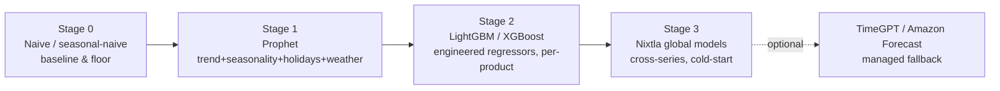
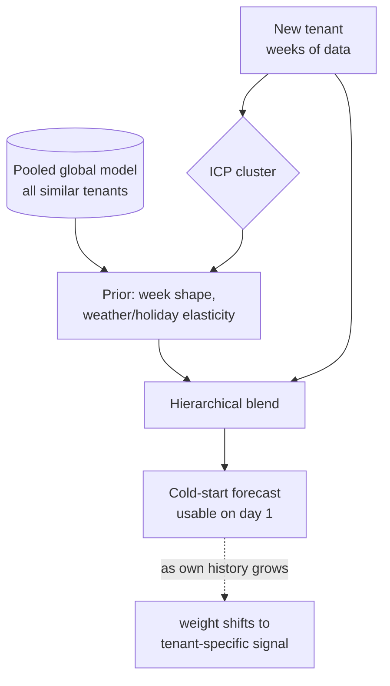

# 07 — AI / ML Strategy

**Project:** SAIL · **Doc:** 07 · **Date:** 2026-07-18 · **Status:** Draft v1.0

---

This document specifies the modeling brain of SAIL: what we predict, with which models, how we handle the fact that most SMBs arrive with thin data, how forecasts become plain-English advice without the LLM ever inventing a number, and how we operate all of it safely per tenant. It builds directly on the clean gold tables and feature store from [Data Strategy & ETL](06_Data_Strategy_and_ETL.md).

Two commitments frame everything below:

1. **The math is deterministic; the language is generative.** Every figure a user sees is computed by the pipeline. The LLM only phrases and prioritizes. This is non-negotiable (§5).
2. **Accuracy compounds with tenants.** Each new business makes cold-start forecasts for the next one better, via pooled models and ICP priors — the moat (§3).

---

## 1. Problem framing — the ML tasks

SAIL is not one model; it is a small portfolio of task-specific models plus a language layer. Four tasks:

| Task | What it produces | Grain | Model family | Consumer |
|------|------------------|-------|--------------|----------|
| **Demand forecasting** | Expected units/revenue for the days ahead | product × day, category × day, location × day | Prophet → LightGBM/XGBoost → global (Nixtla) | Dashboards, prep/staffing advice |
| **KPI anomaly detection** | "Yesterday was abnormal, and here's the likely why" | KPI × day | Forecast-residual bands + seasonal decomposition | Alerts, Morning Brief |
| **Prescriptive recommendation** | Ranked, plain-English actions ("prep 20% more oat milk") | tenant × day | Rules + optimization over forecasts, phrased by LLM | Morning Brief, notifications |
| **ICP & segmentation** | Which business archetype a tenant is | tenant | Clustering over firmographics + behavior | Cold-start priors, benchmarking, personalization |

The tasks are layered: **segmentation** feeds cold-start priors into **forecasting**; forecasting feeds **anomaly detection** (an anomaly is a large forecast residual) and the **prescriptive** layer.

---

## 2. Forecasting model roadmap

We deliberately stage model complexity to data availability. Complexity is earned, not assumed — a café with 6 weeks of history does not need (and cannot support) a gradient-boosted model with 40 regressors.



| Stage | Model | When it applies | Why |
|-------|-------|-----------------|-----|
| **0 — Baselines** | Seasonal-naive, moving average | Always, from day one | The honest accuracy floor. Every other model must beat these on backtest or it doesn't ship. Also the fallback for brand-new tenants. |
| **1 — Prophet** | Additive: trend + weekly/yearly seasonality + holiday regressors + weather | ~8–12+ weeks of history; single series (daily totals, top products) | Robust to gaps/outliers, interpretable components, handles holidays and added regressors (weather) cleanly, needs little tuning. The workhorse baseline that ships in MVP. |
| **2 — LightGBM / XGBoost** | Gradient-boosted trees on the `feature_product_day` matrix (lags, rollings, calendar, weather, events, promos) | Enough per-product history to learn interactions (~4–6+ months, sufficient product volume) | Captures nonlinear interactions Prophet can't (e.g. "hot Saturday + local event ⇒ iced drinks spike"), scales to many products via one model with product as a feature, exploits the full external-regressor set. Primary accuracy driver at scale. |
| **3 — Nixtla global models** | `StatsForecast` / global neural models trained across many series/tenants | When the tenant base is large enough to pool | One model learns shared patterns across hundreds of similar businesses → strong performance on short/sparse series. This is the cold-start engine (§3). |
| **Optional — TimeGPT / Amazon Forecast** | Managed foundation/AutoML forecasting | Spiky niche series, or as a managed challenger | Zero-training convenience and a benchmark to keep our own models honest; used selectively for cost reasons ([doc 10](10_Hosting_and_Infrastructure_Costs.md)). |

**Selection is per series, automatic, and backtested.** The nightly/weekly pipeline picks, per tenant per series, whichever model wins the rolling-origin backtest (champion/challenger, §7). A tenant can simultaneously run Prophet on a low-volume pastry and LightGBM on their espresso line. All forecasting runs on **our own compute** — no per-prediction API fees (cost discipline, [doc 10](10_Hosting_and_Infrastructure_Costs.md)).

---

## 3. The cold-start problem & the data moat

**The problem is universal for SMB analytics:** a new tenant connects a POS with weeks — not years — of history. Single-series models (Stage 0–1) can produce a weak forecast; Stage 2 can't train at all. Naively, SAIL would be least useful exactly when a new customer is deciding whether to keep paying. This is the make-or-break churn moment.

**The solution is to never forecast a new tenant in isolation.** We borrow strength from the tenants we already have:

- **ICP clustering (§6)** places the new tenant into an archetype — e.g. *urban specialty coffee, high AM peak, weekday-skewed* — from firmographics (segment, location type, size, hours) available at signup, before a single sale lands.
- **Pooled / hierarchical models** — the Stage-3 global model, trained across all tenants in that cluster, provides a **prior**: the shape of a typical week, weather elasticity, holiday lift. The new tenant's few weeks of data then *adjust* that prior rather than defining the curve from scratch (partial pooling / hierarchical shrinkage). A café that opened three weeks ago immediately inherits "cafés like you sell 30% more iced drinks when it's above 25°C."
- **Benchmarking priors** — category-level demand shapes (from the unified taxonomy in [doc 06 §5.6](06_Data_Strategy_and_ETL.md)) seed products the tenant has barely sold yet.
- **Graceful degradation** — as the tenant accumulates its own history, model weight shifts from the pooled prior to the tenant-specific signal automatically (the shrinkage factor decays). Day 1: mostly prior. Month 6: mostly its own data.



**Why this is a moat, not just a feature.** Accuracy **compounds with scale**: every new café improves the coffee-shop prior; every hotel sharpens the lodging prior. A well-funded copycat can license the same weather API and the same LightGBM library, but cannot replicate the accumulated, taxonomy-aligned, cross-tenant demand priors without first acquiring a comparable base of tenants. The cross-tenant learning is done **only on aggregated/anonymized signals** — never raw tenant data — which is both the privacy guarantee (§6, [doc 09](09_Security_and_Compliance.md)) and, not coincidentally, what makes the moat defensible.

---

## 4. External regressors & feature engineering

The differentiator over a plain time-series tool is that SAIL explains demand with the outside world. Features are engineered in the gold feature tables ([doc 06 §7](06_Data_Strategy_and_ETL.md)) so training and nightly inference read identical definitions (no train/serve skew).

| Feature group | Examples | Source / derivation |
|---------------|----------|---------------------|
| **Weather** | temp, precip, humidity, weather code; *forecasted* values over the prediction horizon | Visual Crossing / OpenWeather, joined by location × day |
| **Holidays** | is_holiday, holiday name, day-before/after, long-weekend flags | Nager.Date / Calendarific |
| **Events** | nearby event count, capacity/impact score, distance, event category | Ticketmaster/SeatGeek/PredictHQ/Eventbrite |
| **Calendar** | day-of-week, **daypart** (breakfast/lunch/dinner where grain allows), week, month, season, paydays | `dim_date` |
| **Promotions** | promo/discount flag, price level, price change vs baseline | From POS discount fields / tenant input |
| **Local seasonality** | school terms, tourist season, local climate patterns | Derived per `geo_market` |
| **Autoregressive** | lags (1, 7, 14, 28 days), rolling mean/std (7, 28), YoY same-week | Computed on `feature_product_day` |
| **Cross-tenant (aggregate)** | ICP-cluster demand index, category benchmark | Anonymized pooled signal (§6) |

Two subtleties that separate a working forecaster from a broken one:

- **Weather must be the *forecast*, not the actual, at prediction time.** We store both — actuals for training, the forward forecast for scoring — and never leak future actuals into training (a classic leakage bug). Weather-forecast error is an inherent, honestly-modeled uncertainty component (§10).
- **Events need impact weighting, not just counts.** A 20,000-seat concert 400m away is not the same as a 50-person meetup; PredictHQ-style impact scores and distance decay matter more than raw event counts.

The **feature store** is the set of versioned gold feature tables. It is the single contract between [doc 06](06_Data_Strategy_and_ETL.md) and this document: the pipeline materializes features nightly; models train and score against exactly those columns.

---

## 5. The prescriptive layer — forecasts + rules + LLM

This is where SAIL stops being a dashboard and starts being an advisor. The output is the **Morning Brief**: a short, plain-English digest an owner reads with their coffee, plus ranked action recommendations.

**The pipeline is three separated stages, and the separation is the whole point:**


1. **Deterministic layer** — the forecasting and anomaly models produce every number: expected demand per product, revenue forecast, confidence intervals, yesterday's variance vs expectation, week-over-week deltas. Pure computation from the warehouse.
2. **Rules / optimization layer** — deterministic business logic turns forecasts into candidate actions: safety-stock buffers, prep quantities, staffing ratios (e.g. covers-per-server), reorder points, upsell/promo triggers. Each candidate is scored and ranked (expected revenue impact, waste avoided, confidence). Output is a set of **structured recommendation objects** — machine-generated, fully numeric, with the driving reason attached.
3. **LLM layer (phrasing & prioritization only)** — a cheap model (Claude Haiku / GPT-4o-mini) receives the structured objects and writes the brief. **CRITICAL constraint:** the LLM is given the numbers as ground truth and is instructed and constrained to *use them verbatim* — it may reorder, group, summarize, and choose tone, but it may not compute, estimate, or invent any figure.

**Guardrails against hallucinated figures:**

- **Grounding** — the prompt contains only the computed structured objects; the model is told these are the sole source of numbers.
- **Structured output** — the LLM returns a constrained JSON schema (recommendation id, headline, body, referenced metric ids) rather than free text; every number in the body must reference an id present in the input.
- **Numeric validation / post-check** — a deterministic verifier scans the generated text for numeric tokens and confirms each matches a value in the source objects; a mismatch triggers a regeneration or falls back to a template. Numbers therefore *cannot* drift.
- **Templated fallback** — if the LLM is unavailable or fails validation, a deterministic template renders the same structured objects. The product never blocks on the LLM.
- **No tool-use math** — the model is never asked to calculate; arithmetic lives entirely upstream.

**Concrete example.** Deterministic + rules layer emits:

```json
{
  "rec_id": "prep-oatmilk-2026-07-19",
  "type": "inventory_prep",
  "product": "Oat milk (latte base)",
  "forecast_units": 128, "forecast_ci": [110, 146],
  "baseline_units": 98, "delta_pct": 31,
  "drivers": ["saturday", "forecast_high_27C", "farmers_market_event_0.4km"],
  "action": "prep_extra", "action_qty_pct": 25,
  "expected_waste_avoided_usd": 40, "confidence": 0.82
}
```

The LLM renders:

> **Saturday looks busy — prep extra oat milk.** We expect about **128 oat-milk drinks** tomorrow (vs a normal Saturday's ~98), driven by warm weather (27°C) and the farmers' market 0.4 km away. Prep roughly **25% more oat milk** than usual to avoid an 11am stockout. Confidence: high.

Every figure (128, 98, 27°C, 25%) came from the deterministic object; the LLM supplied only the sentence. See [Appendix A — KPI & Metrics Catalog](appendix/A_KPI_and_Metrics_Catalog.md) for the metric definitions behind these.

---

## 6. ICP & personalization

SAIL is personalized at two levels, with a hard privacy boundary between them.

**Per-tenant learning (private).** Each tenant's own models, thresholds, and calibrated confidence are trained on *its* data only. Its dashboards, anomaly bands, and recommendations reflect its history, hours, product mix, and location. Nothing about its raw sales leaves its boundary.

**Cross-tenant learning (aggregate/anonymized only).** ICP clustering and the pooled global models (§3) learn from **many tenants at once**, but only via aggregated/anonymized signals — cluster-level demand shapes, category elasticities, benchmark indices. What trains what:

| Signal | Trains | Scope |
|--------|--------|-------|
| Tenant's own sales history + features | That tenant's Prophet/GBM models, thresholds, calibration | **Private, per-tenant** |
| Firmographics (segment, location type, size, hours) | ICP cluster assignment | Per-tenant input, shared model |
| **Aggregated** cluster demand shapes / category benchmarks | Pooled global model + cold-start priors | **Cross-tenant, anonymized** |
| Weather/holiday/event responses | Both — private fit + pooled prior | Mixed |

**Privacy model (link [Security & Compliance](09_Security_and_Compliance.md)):**

- **No raw data leakage** — one tenant's transactions, product names, or customers are never visible to, or used to directly serve, another tenant. Cross-tenant learning consumes only aggregates computed over many tenants.
- **Aggregation thresholds** — a cluster benchmark is only published/used when it aggregates over a minimum number of tenants (k-anonymity-style floor), so no benchmark can be reverse-engineered to a single business.
- **Differential-privacy consideration** — for published benchmarks and any cross-tenant statistic, DP noise (bounded ε) is on the roadmap to make individual contribution provably non-recoverable. Flagged as a design consideration, not a v1 guarantee.
- **Enforcement** — tenant isolation is enforced at the database (Postgres RLS on `tenant_id`) and storage layers, not just in application code ([doc 06 §7](06_Data_Strategy_and_ETL.md), [doc 09](09_Security_and_Compliance.md)).

---

## 7. Training, retraining & evaluation

Two cadences, deliberately split by cost and need:

| Cadence | What runs | Why |
|---------|-----------|-----|
| **Nightly refresh (inference)** | Re-score forecasts with the current champion using fresh actuals + updated weather/event forecasts; refresh anomaly bands; regenerate briefs | Cheap, keeps outputs current daily without the cost of retraining |
| **Weekly retrain** | Refit models on the expanded window; run challengers; rolling-origin backtests; update champion + registry; refresh cold-start priors | Model *parameters* change slowly; weekly balances freshness against compute cost ([doc 10](10_Hosting_and_Infrastructure_Costs.md)) |

Ad-hoc retrains trigger on drift detection (§8) or a major event (POS migration, new location).

**Evaluation metrics** — chosen for intermittent, count-style SMB demand where MAPE misbehaves:

| Metric | Role | Note |
|--------|------|------|
| **WAPE** (weighted abs. % error) | Primary headline accuracy | Robust to low-volume days where MAPE explodes near zero |
| **MASE** (mean abs. scaled error) | Skill vs seasonal-naive | < 1 means we beat the naive baseline — the bar every model must clear |
| **MAPE** | Reported per-product where volume is adequate | Intuitive for owners, but never the sole gate (undefined on zero-sales days) |
| **Pinball loss / coverage** | Quality of prediction intervals | The CIs feed safety-stock rules (§5), so calibrated intervals matter as much as the point forecast |
| **Bias (ME)** | Systematic over/under-prediction | Persistent bias drives waste or stockouts — monitored explicitly |

**Backtesting is rolling-origin (walk-forward), never a random split** — time-series data must respect chronology to avoid leakage. We expand the training window, forecast the held-out next horizon, roll forward, and average. **Champion/challenger:** the incumbent (champion) is compared each weekly cycle against challengers (other stages/hyperparameters); a challenger is promoted only if it beats the champion on the rolling backtest by a meaningful margin, per tenant per series. Everything is logged to MLflow (§8).

---

## 8. MLOps

| Concern | Approach |
|---------|----------|
| **Experiment tracking** | MLflow logs every training run: params, features, metrics (WAPE/MASE/coverage), backtest windows, dataset/feature version. Reproducible and comparable. |
| **Model registry** | MLflow registry holds versioned models with stage tags (staging/champion/archived), **per tenant per series**. The nightly scorer loads the current champion by registry lookup — no hardcoded artifacts. |
| **Per-tenant versioning** | Because model selection is per tenant per series, the registry tracks potentially thousands of small models; naming/namespacing is `tenant/series/model` with lineage back to the feature version used. |
| **Drift monitoring** | Monitor input drift (feature distributions), prediction drift, and — the one that matters — **realized error drift** (rolling WAPE vs backtest expectation). A sustained error-drift breach triggers an ad-hoc retrain and an internal alert. |
| **Human-in-the-loop** | Two loops: (1) onboarding taxonomy-mapping confirmation ([doc 06 §5.6](06_Data_Strategy_and_ETL.md)); (2) recommendation feedback — owners can accept/dismiss actions, and that signal is logged to tune rule thresholds and prioritization over time. Owners are never asked to tune models. |
| **Safe rollout** | Challenger promotion is gated on backtest wins; new global-model versions shadow-run before replacing a champion. Rollback is a registry stage flip. |
| **Reproducibility** | Model version ↔ feature version ↔ raw vault snapshot are all linked (via [doc 06](06_Data_Strategy_and_ETL.md) lineage), so any past forecast can be reproduced and explained. |

---

## 9. LLM usage & cost control

The LLM is a *phrasing* component, not the product engine, and is budgeted accordingly.

- **Cheap models by default** — Claude Haiku / GPT-4o-mini for briefs and recommendations. The heavy lifting (forecasting) runs on our own compute; the LLM only turns small structured objects into a few sentences, so a top-tier model is unnecessary.
- **Prompt caching** — the static system prompt, format instructions, and tone/brand guidance are cached across all tenants and all nights; only the small per-tenant structured payload is dynamic. This slashes input-token cost at scale.
- **Batching** — nightly brief generation is batched across tenants in the `generate_briefs` flow ([doc 06 §8](06_Data_Strategy_and_ETL.md)) to exploit batch pricing where available.
- **Token budgets per tenant** — each tenant/tier has a bounded token allowance per period; structured output keeps generations short and predictable. Overage falls back to the deterministic template (§5) rather than incurring surprise cost.
- **No LLM in the hot path for numbers** — since figures are computed upstream and validated, we never pay for the model to "reason" over data, and we never risk hallucinated math.

Full cost modeling — per-tenant LLM spend, caching savings, compute for forecasting — is in **[10 — Hosting & Infrastructure Costs](10_Hosting_and_Infrastructure_Costs.md)**.

---

## 10. Honest accuracy expectations & caveats

Senior-engineer honesty, because over-promising forecast accuracy to SMBs is the fastest route to churn:

- **Sparse data caps accuracy.** A café with two months of history and 60 products has few observations per product per weekday. Per-product daily forecasts for low-volume items will have wide intervals; **category- and daily-total forecasts are far more reliable than long-tail per-SKU forecasts.** We present the reliable grain prominently and the uncertain grain with visible confidence bands.
- **Absolute accuracy varies by grain and volume.** Rough, honest expectations (to be validated in Phase 0/1, not promised contractually): daily-total demand often lands in a useful single-digit-to-low-double-digit WAPE for established tenants; per-product long-tail can be much higher. The real product claim is **"materially better than the owner's gut and the seasonal-naive baseline"** (MASE < 1), not a specific percentage.
- **Irreducible uncertainty is real.** Weather forecasts are themselves wrong; surprise events, staff sickness, viral moments, and one-off caterings are unmodelable. We forecast the predictable component and quantify the rest as intervals — never as false precision.
- **New tenants get priors, not magic.** Cold-start (§3) makes day-1 output *useful*, not *accurate-to-the-unit*. We say so, and the accuracy visibly improves as their data accrues — which is itself a retention story.
- **Prediction intervals over point forecasts.** Because the prescriptive rules (§5) act on the *distribution* (safety stock uses the upper interval), calibrated uncertainty is a first-class deliverable, not an afterthought.
- **The LLM never hides uncertainty.** Confidence is passed from the deterministic layer into the brief ("Confidence: high/medium/low"), so recommendations carry their own reliability honestly.

The guiding principle: **be useful and honest before being impressive.** A trusted "prep ~25% more, we're fairly confident" beats a precise-sounding number that's wrong.

---

## Related documents

- [05 — System Architecture](05_System_Architecture.md) — where models, MLflow, and the scoring/brief flows run
- [06 — Data Strategy & ETL](06_Data_Strategy_and_ETL.md) — the feature store, gold tables, and nightly flows these models consume
- [09 — Security & Compliance](09_Security_and_Compliance.md) — tenant isolation, cross-tenant privacy, differential-privacy roadmap
- [10 — Hosting & Infrastructure Costs](10_Hosting_and_Infrastructure_Costs.md) — forecasting compute and LLM cost control
- [Appendix A — KPI & Metrics Catalog](appendix/A_KPI_and_Metrics_Catalog.md) — metric definitions behind forecasts and briefs
- [Appendix B — Data Sources & Integrations](appendix/B_Data_Sources_and_Integrations.md) — external-regressor sources and limits
- [Appendix C — Assumptions & Constants](appendix/C_Assumptions_and_Constants.md) — accuracy assumptions, stack summary, canonical figures
