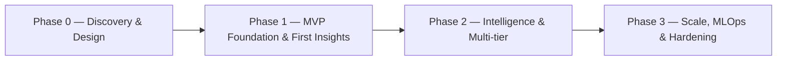

# Delivery Plan & Timeline

**Project:** SAIL · **Doc:** 12 · **Date:** 2026-07-18 · **Status:** Draft v1.0

> Effort and calendar durations are intentionally left as **_TBD_** — the founding team will set the schedule. This document defines the *plan and sequence*, not the dates.

This document describes how we build SAIL: the phased plan, milestones, sequence, the founding team, ways of working, and who owns what. Costs for each phase are in [Build Cost & Capital Plan](11_Build_Cost_and_Commercials.md); the economics the build has to earn back are in [Business Model & Unit Economics](15_Business_Model_and_Unit_Economics.md); the constants referenced here follow [Appendix C](appendix/C_Assumptions_and_Constants.md).

---

## 1. Build approach

We run SAIL as an **agile build with phase gates**:

- **Two-week sprints.** Each sprint ends in working, demoable software and a short review.
- **Phase gates.** Each phase closes with a go/no-go review against explicit exit criteria. Nothing moves forward until the gate is cleared — this is where we confirm the scope and budget for the next phase before committing further spend.
- **Value early, then depth.** Phase 1 puts a live MVP in pilot hands; Phases 2–3 add intelligence, tiering, scale, and hardening.
- **Transparent by default.** We run an open backlog and board, and demo every sprint. No black boxes.

The phases and gates below define the sequence and what must be true before each stage begins. The calendar — start date, phase durations, and gate weeks — is **_TBD_** and will be set by the founding team.

---

## 2. Phase-by-phase plan

### Overview

| Phase | Focus | Key deliverables | Effort | Duration |
|---|---|---|:--:|:--:|
| **Phase 0 — Discovery & Design** | De-risk scope, lock the architecture, confirm phase budgets | Prioritized backlog & success metrics; technical architecture; connector shortlist; wireframes + clickable prototype | _TBD_ | _TBD_ |
| **Phase 1 — MVP Foundation & First Insights** | Stand up the multi-tenant platform; first live dashboards & forecasts to pilots | Tenant isolation + auth; first connectors; ETL & warehouse; baseline forecasts; live dashboards; alerts/reports; daily cron | _TBD_ | _TBD_ |
| **Phase 2 — Intelligence & Multi-tier** | Prescriptive AI + full commercial tiering | Per-tenant prescriptive recommendations; improved forecast accuracy; full tier enforcement; expanded reporting | _TBD_ | _TBD_ |
| **Phase 3 — Scale, MLOps & Hardening** | Self-improving, scalable, hardened platform | Automated retraining & monitoring; drift detection; performance/scale; security hardening & compliance; load/resilience testing | _TBD_ | _TBD_ |

### Detail

#### Phase 0 — Discovery & Design
- **Objectives:** de-risk scope, lock the architecture, confirm the build budget for Phases 1–3.
- **Key workstreams:** discovery/UX, architecture & multi-tenant data model, POS/connector feasibility.
- **Deliverables:** prioritized backlog & success metrics; technical architecture (see [System Architecture](05_System_Architecture.md)); connector shortlist; wireframes + clickable dashboard prototype; confirmed phase budgets.
- **Exit criteria:** scope, architecture, and prototype confirmed; phase budgets set. **(Gate: _TBD_)**

#### Phase 1 — MVP Foundation & First Insights
- **Objectives:** stand up the multi-tenant platform and deliver the first live dashboards and forecasts to a pilot cohort.
- **Key workstreams:** foundation & multi-tenancy, ingestion/connectors, ETL/warehouse, baseline ML/forecasting, dashboard UI, notifications/reports, daily cron.
- **Deliverables:** tenant isolation + auth + ICP scaffolding; first POS + external-signal connectors; ETL pipeline & warehouse; baseline demand/sales forecasts; live dashboards; core alerts/reports; daily cron ingestion.
- **Exit criteria:** MVP live for pilot businesses; forecasts and dashboards validated against pilot data. **(Gate: _TBD_ — MVP LIVE)**

#### Phase 2 — Intelligence & Multi-tier
- **Objectives:** turn insight into prescriptive AI and open the full commercial tiering.
- **Key workstreams:** GenAI/prescriptive recommendations, forecasting accuracy, additional signals, tiering & entitlements, dashboard depth.
- **Deliverables:** per-tenant ICP-aware prescriptive recommendations; improved forecast accuracy; full tier enforcement (Starter $200 / Growth $500 / Scale $800; optional Lite $79–99); expanded reporting.
- **Exit criteria:** prescriptive engine live and gated by tier; v1 commercially ready to onboard paying tenants. **(Gate: _TBD_ — v1 COMPLETE)**

#### Phase 3 — Scale, MLOps & Hardening
- **Objectives:** make the platform self-improving, scalable, and hardened for growth.
- **Key workstreams:** MLOps (retraining, monitoring, drift), scale/performance, security hardening, QA hardening.
- **Deliverables:** automated retraining & model monitoring; drift detection; performance/scale improvements; security hardening, audit logging, compliance controls; load & resilience testing.
- **Exit criteria:** MLOps operational; scale and security targets met; full platform ready for growth. **(Gate: _TBD_ — FULL PLATFORM)**

---

## 3. Milestones

| Milestone | Week | Deliverable |
|---|---|---|
| Start | _TBD_ | Team set up, environments provisioned, backlog seeded |
| Discovery gate | _TBD_ | Scope, architecture, prototype confirmed; phase budgets set |
| Foundation ready | _TBD_ | Multi-tenant core + first connector + ETL online |
| First insights | _TBD_ | Baseline forecasts + first live dashboards in staging |
| **MVP live** | _TBD_ | MVP in production for pilot cohort |
| Prescriptive AI live | _TBD_ | Per-tenant GenAI recommendations in product |
| **v1 complete** | _TBD_ | Full tiering + intelligence; commercially ready |
| MLOps operational | _TBD_ | Automated retraining + monitoring + drift detection |
| **Full platform** | _TBD_ | Scale, security, and hardening complete |

---

## 4. Phase sequence

*This diagram shows sequence only. The calendar — start date and phase durations — is **_TBD_** and will be set by the founding team.*

---

## 5. Team: founding team + who we hire as we scale

SAIL is built by a two-person founding team, with specialist roles brought in as contractors or hires when bandwidth and funding allow.

### Founding team
- **Technical lead / developer.** Accountable for architecture, the multi-tenant data model, the full-stack build, data/ML integration, DevOps, and technical quality across all phases.
- **Founder — business the founder — founder, business & GTM GTM.** Accountable for commercial traction: business input, POS test/sandbox accounts, pilot recruitment, the customer feedback loop, pricing validation, and go-to-market.

### Roles to hire or contract as we scale

| Role | Covered by | P0 | P1 | P2 | P3 | Bring on when |
|---|---|:--:|:--:|:--:|:--:|---|
| Technical lead / architect | the developer | ● | ● | ● | ● | Core — engaged throughout |
| Full-stack (Next.js/FastAPI) | the developer (+ contractor) | ○ | ● | ● | ● | Add a contractor in Phase 1+ if build velocity needs it |
| Data engineer (ingestion/ETL/warehouse) | the developer → hire/contract | ○ | ● | ● | ● | Contract in for Phase 1 data-heavy work if scope exceeds the developer's bandwidth |
| ML engineer / data scientist | Hire/contract | ○ | ● | ● | ● | Contract in for Phase 1–2 modelling; consider a hire before Phase 3 MLOps |
| Frontend / UI (dashboard & tiering) | the developer (+ contract designer) | ● | ● | ● | ○ | Front-loaded design help in Phase 0–1 |
| Designer (UX flows & visual) | Contract | ● | ○ | ○ | — | Front-loaded, mostly Phase 0 |
| QA (test coverage & DoD) | Contract | — | ● | ● | ● | Contract in from Phase 1 |
| Business / GTM / customer dev | the founder | ● | ● | ● | ● | Core — engaged throughout |
| Delivery / cadence | Founders | ● | ● | ● | ● | Founders run cadence; formalize if the team grows |

● engaged · ○ light/part-time · — not engaged. Per-role effort and the resulting build budget are **_TBD_** and will be set by the founders; an in-house build (developer-led) is a lower cash outlay than contracting the same scope. See [Build Cost & Capital Plan](11_Build_Cost_and_Commercials.md).

---

## 6. Ways of working

- **Ceremonies:** sprint planning and sprint review/demo every 2 weeks; brief daily async stand-up; retro each sprint.
- **Demos:** every sprint ends in a live demo of working software, shared with pilot partners where useful.
- **Comms cadence:** shared Slack channel for day-to-day; weekly written status; a review at each phase gate.
- **Tools:** **Linear or Jira** for backlog & sprints; **Slack** for comms; **GitHub** for source, PR review, and CI/CD; shared docs for specs and decisions.
- **Transparency:** live board, open backlog, and visible burndown throughout.

---

## 7. Founder & team responsibilities

Hitting the plan depends on both founders holding up their side.

**the founder — business & GTM:**
- **Business input** — domain requirements, ICP definitions, and priorities.
- **POS test/sandbox accounts** — access to target POS systems, in place by end of Phase 0.
- **Pilot businesses** — **5–10 pilot businesses** (cafés/restaurants/ice-cream/hotels/motels) recruited and available for onboarding by Phase 1.
- **Customer feedback loop** — gather pilot feedback on demos/deliverables and relay it within ~2 business days.
- **Go-to-market** — pricing validation, positioning, and the acquisition motion.

**the developer — technical build:**
- **Architecture & build** — multi-tenant data model and the full-stack platform across all phases.
- **Data & ML** — connectors/ETL, forecasting, prescriptive AI, and MLOps.
- **Delivery infrastructure** — environments, CI/CD, deployment, runbooks, and security hardening.

**Both:**
- **Phase-gate decisions** — go/no-go, scope, and budget at each gate.
- **Scaling the team** — bringing on contractors or hires when bandwidth or funding requires.

Our single biggest schedule risk is two-person bandwidth plus pilot availability; see the [Risk Register](13_Risks_Assumptions_Dependencies.md).

---

## 8. QA / testing & Definition of Done

- **Testing approach:** unit + integration tests for platform and ETL; model validation and backtesting for forecasts; end-to-end tests for critical dashboard and tiering flows; CI runs on every PR.
- **Definition of Done (per story):** code reviewed and merged; tests written and passing in CI; meets acceptance criteria; documented; deployed to staging; demoed in sprint review.
- **Phase Definition of Done:** all phase deliverables met against exit criteria; no open critical/high defects; runbook/docs updated.

---

## 9. Launch / go-live & operations

- **MVP go-live (Gate: _TBD_):** staged rollout to the pilot cohort with monitoring, rollback plan, and daily cron verified in production.
- **v1 go-live (Gate: _TBD_):** tiering and prescriptive AI enabled for onboarding paying tenants.
- **Operational readiness:** we maintain architecture docs, runbooks, and secrets/credentials management as our own operating assets.
- **Post-launch operations:** ongoing operations, monitoring, and MLOps run at an operating run-rate of **_TBD_** — see [Build Cost & Capital Plan](11_Build_Cost_and_Commercials.md) and [Business Model & Unit Economics](15_Business_Model_and_Unit_Economics.md).

---

## Related documents

- [00 — Summary](00_Summary.md)
- [03 — Functional Requirements](03_Functional_Requirements.md)
- [05 — System Architecture](05_System_Architecture.md)
- [11 — Build Cost & Capital Plan](11_Build_Cost_and_Commercials.md)
- [13 — Risks, Assumptions & Dependencies](13_Risks_Assumptions_Dependencies.md)
- [14 — Roadmap & Next Steps](14_Tender_Summary_and_Next_Steps.md)
- [15 — Business Model & Unit Economics](15_Business_Model_and_Unit_Economics.md)
- [Appendix C — Assumptions & Constants](appendix/C_Assumptions_and_Constants.md)
